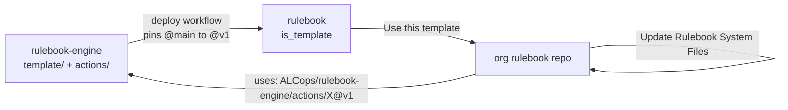

# Rulebook engine

The engine behind [ALCops/rulebook](https://github.com/ALCops/rulebook): the composite GitHub Actions, PowerShell modules, tests and contributor documentation that the workflows in an org rulebook repo call. Users never create a repository from this one; they create it from the template and their workflows reference `ALCops/rulebook-engine/actions/<Name>@v1`.

> **Status:** design phase. The architecture and the decisions are written; no action or module exists yet. The work is broken down into [work package issues](https://github.com/ALCops/rulebook-engine/issues?q=is%3Aissue+label%3Aworkpackage) (WP00 to WP15), ordered and tracked on the [Rulebook v1 project board](https://github.com/orgs/ALCops/projects/1); the parent issue [Rulebook v1 (#18)](https://github.com/ALCops/rulebook-engine/issues/18) holds the dependency graph and the suggested order.

---

## Contents

1. [Repository layout](#1-repository-layout)
2. [Relation to the template](#2-relation-to-the-template)
3. [Working on the engine](#3-working-on-the-engine)
4. [Documentation](#4-documentation)

---

## 1. Repository layout

| Path | Content | Status |
|---|---|---|
| `actions/<Name>/action.yaml` | Composite actions: `Validate`, `Publish`, `CheckForUpdates`, `ScanDiagnostics`, `ChangeRule`. Each runs a PowerShell 7 script on `ubuntu-latest`. | planned (WP03 to WP09) |
| `modules/Rulebook.*.psm1` | PowerShell modules shared by the actions: `Rulebook.Generate` (level chain + stage deltas + twins setting + overrides + quarantine to sparse flat endpoints, effective diff), `Rulebook.Validate`, `Rulebook.Template`, `Rulebook.Settings`, `Rulebook.NuGet`, `Rulebook.Git`. | planned |
| `template/` | Source of the template content that a deploy workflow copies into `ALCops/rulebook`, pinning action references from `@main` to `@v1`. Its `base/`, `stages/` and `rulesets/` are generated from `docs/rulebook/`. | planned (WP04, WP13) |
| `tests/` | Pester 6 suites, one per module and action, with fixtures under `tests/fixtures/`. | smoke test (WP00); suites per module from WP12 |
| `docs/` | Architecture, decision records (`adr/`), references, and `docs/rulebook/` with the level content (inventory, matrix, composition spec). | written |
| `tools/rulebook/` | PowerShell scripts that extract the inventory from the analyzer sources, build the matrix (ladders, stage columns, twin pairs, counts) and verify it (`Extract-Inventory.ps1`, `Build-Matrix.ps1`, `Test-Rulebook.ps1`). | written |
| `.github/workflows/` | `ci.yml` (PSScriptAnalyzer, Pester) and the deploy workflow. | CI written (WP00); deploy planned (WP13) |
| `CONTRIBUTING.md` | Conventions, running the checks locally, CI, branches, repository settings and pull request rules. | written |

## 2. Relation to the template



The template is the product users see. The engine is where the logic lives, versioned by branch (`v1`) so that an org repo never executes unreviewed `main` code. See [docs/ARCHITECTURE.md](docs/ARCHITECTURE.md) section 3.

## 3. Working on the engine

Requirements: PowerShell 7.4 or later, Pester 6, PSScriptAnalyzer. Everything must run on Linux; no Windows-only dependency is accepted. Conventions, CI, branches and pull request rules are in [CONTRIBUTING.md](CONTRIBUTING.md).

```powershell
Install-Module Pester -MinimumVersion 6.0 -Scope CurrentUser
Install-Module PSScriptAnalyzer -Scope CurrentUser
Invoke-Pester -Path ./tests -Output Detailed
Invoke-ScriptAnalyzer -Path . -Recurse -Settings ./PSScriptAnalyzerSettings.psd1
```

### Work packages and scope

The backlog is GitHub issues: one issue per work package (label `workpackage`, sections 1 to 9 as in the *Work package* issue form), spikes as sub-issues, and the parent issue *Rulebook v1* with the dependency graph and the suggested order. Status, size and order are fields on the [Rulebook v1 project board](https://github.com/orgs/ALCops/projects/1); nothing else tracks status. Before starting an issue, read it, [ARCHITECTURE.md](docs/ARCHITECTURE.md) and the decision records it lists under Inputs.

Work found while doing an issue becomes its own issue (issue form *Task or spin-off*, label `spin-off`) linked from the originating one. It is not added to the current issue's scope. Open design questions are issues labeled `decision` and close by adding a record under [docs/adr/](docs/adr/README.md).

### Definition of done

A work package issue is done when all of the following hold:

1. Every deliverable in its section 5 exists in the named repository.
2. Every acceptance criterion in its section 6 is ticked, with evidence in the pull request (log excerpt, screenshot or test name).
3. The Pester tests listed in its section 7 exist and are green on `ubuntu-latest` in the engine CI.
4. `Invoke-ScriptAnalyzer` reports no error or warning on the touched `.ps1` and `.psm1` files.
5. Docs touched by the issue are updated: `docs/ARCHITECTURE.md` when the design changed, a new record under `docs/adr/` when a decision was taken, the user docs in `ALCops/rulebook/docs` when behaviour visible to an organization changed. Design notes in the issue that describe the target design are lifted into `docs/`.
6. The pull request was reviewed before merge (another maintainer, or an automated code review whose outcome is recorded in the PR body), merged, and closes the issue (`Closes #n`).
7. The pull request carries one release-note label and a title that reads as a release line (release notes are generated from both, [D38](docs/adr/0038-release-notes-are-generated-from-pull-request-labels.md)).

For any other change: documentation updated, Pester green on `ubuntu-latest`, PSScriptAnalyzer clean, reviewed pull request, a release-note label and a title that reads as a release line.

## 4. Documentation

| Document | What it is |
|---|---|
| [docs/ARCHITECTURE.md](docs/ARCHITECTURE.md) | The target architecture: topology, generation model, endpoints, workflows, settings, hosting, failure model. |
| [docs/adr/README.md](docs/adr/README.md) | Decision records (one file per decision, numbered D1 onward) with rationale and rejected alternatives; open decisions are issues labeled `decision`. |
| [docs/reference/compiler-ruleset-internals.md](docs/reference/compiler-ruleset-internals.md) | How the AL compiler loads and merges rulesets, from the SDK source. Every design constraint comes from here. |
| [docs/reference/al-go-template-mechanics.md](docs/reference/al-go-template-mechanics.md) | How AL-Go implements templates, system-file updates and the GhTokenWorkflow secret, and what Rulebook reuses. |
| [docs/reference/spikes/README.md](docs/reference/spikes/README.md) | Results of the WP01 spikes: question, method, versions, observations and answer per experiment. |
| [docs/rulebook/README.md](docs/rulebook/README.md) | The level content: inventory of every diagnostic id, the matrix placing each id per level and stage, the twin pairs, the placement algorithm, and the generator contract for the level files (a root delta plus one delta per further level), the stage files and the sparse endpoints in `template/base/`, `template/stages/` and `template/rulesets/`. |
| [Work package issues](https://github.com/ALCops/rulebook-engine/issues?q=is%3Aissue+label%3Aworkpackage) | The 16 work packages WP00 to WP15 as issues; the parent issue [Rulebook v1 (#18)](https://github.com/ALCops/rulebook-engine/issues/18) has the dependency graph and the suggested order, the [Rulebook v1 project board](https://github.com/orgs/ALCops/projects/1) the status. |

## License

MIT, see [LICENSE](LICENSE).
