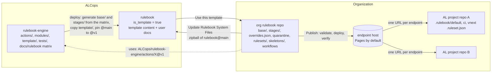
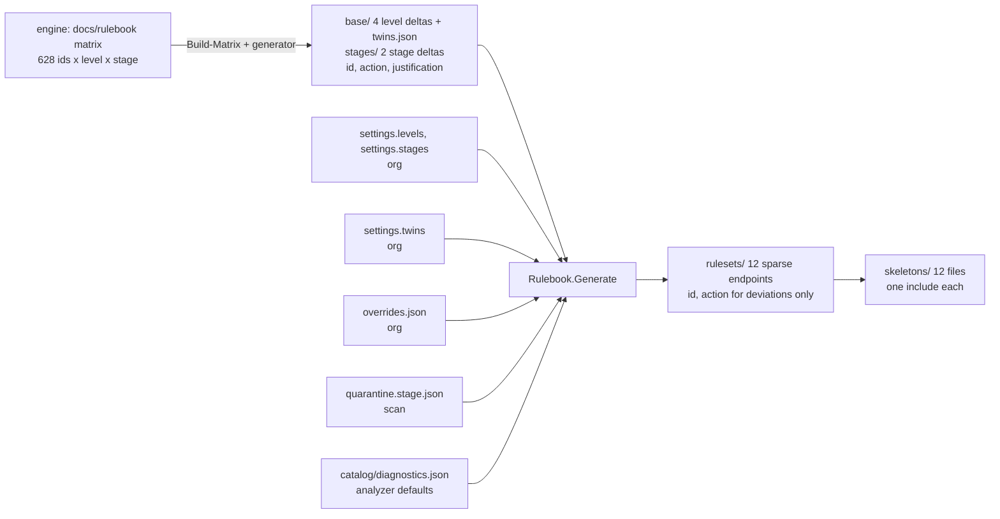
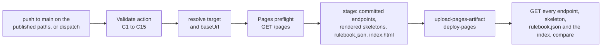
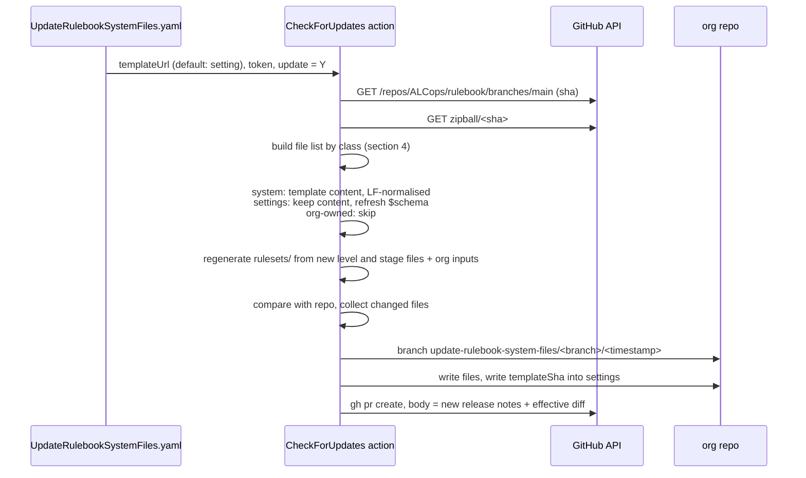
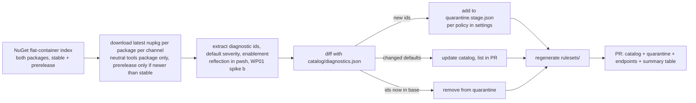
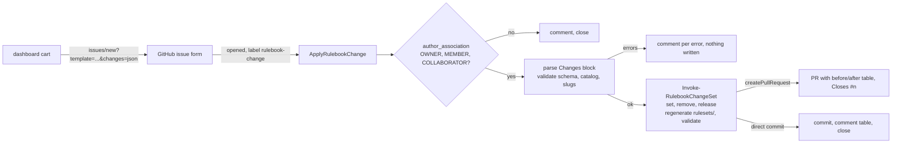

# Rulebook architecture

Target architecture of Rulebook: the repositories, the generation model of the ruleset files, the endpoints, the workflows that keep an org rulebook repo valid, published and current, the settings, the hosting targets and the failure model. The constraints come from how the AL compiler loads rulesets ([reference/compiler-ruleset-internals.md](reference/compiler-ruleset-internals.md)) and from how AL-Go updates system files ([reference/al-go-template-mechanics.md](reference/al-go-template-mechanics.md)).

> **Status:** target design after the requirements interviews of 2026-09-29, revised on 2026-10-01 when the target dimension was removed and endpoints became sparse (D21 to D24), and again on 2026-10-01 when the everything-off level was dropped, levels and stages became configuration and the source files became deltas (D25 to D30), and on 2026-10-03 when the dashboard and its issue-form write path were added (D31 to D37, design in [dashboard.md](dashboard.md)). Decisions are recorded in [adr/README.md](adr/README.md), the implementation is broken down into [work package issues](https://github.com/ALCops/rulebook-engine/issues?q=is%3Aissue+label%3Aworkpackage). The level content itself is specified in [rulebook/README.md](rulebook/README.md). Names of files and settings keys are finalised by WP02 ([#4](https://github.com/ALCops/rulebook-engine/issues/4)); the authoritative list is [reference/naming.md](reference/naming.md).

---

## Contents

1. [Purpose and requirements](#1-purpose-and-requirements)
2. [Principles](#2-principles)
3. [Repository topology](#3-repository-topology)
4. [Org rulebook repo layout](#4-org-rulebook-repo-layout)
5. [Generation model](#5-generation-model)
6. [Endpoints and skeletons](#6-endpoints-and-skeletons)
7. [Workflows](#7-workflows)
8. [Settings](#8-settings)
9. [Hosting targets](#9-hosting-targets)
10. [Failure model and operational risks](#10-failure-model-and-operational-risks)
11. [Open decisions](#11-open-decisions)
12. [References](#12-references)
13. [Appendix: quick reference](#13-appendix-quick-reference)

---

## 1. Purpose and requirements

Rulebook gives an organization one place to decide which analyzer diagnostic is shown at which severity for its AL projects, publishes those decisions as URLs, and automates the chores around it: validation, publishing, adopting new analyzer rules, changing a rule, and updating the automation itself.

The requirements as gathered on 2026-09-29:

| # | Requirement | Where it lands |
|---|---|---|
| R1 | Endpoints: URLs to put in `al.ruleSetPath`, the AL-Go `rulesetFile`, or the single include of the project skeleton. | Section 6, WP04, WP05 |
| R2 | Private source repo, public endpoint files. | Section 9, WP05 |
| R3 | Skeleton files per endpoint to copy into an AL project, with local exceptions. | Section 6.3, WP06 |
| R4 | "Use this template": every org gets its own Rulebook. | Section 3, WP00, WP04 |
| R5 | An update action like AL-Go's, preserving the org's own changes. | Section 7.3, WP07 |
| R6 | Starting points: everything opted out, or a best-practice level. | Section 5.1, WP10; everything-off is an org-added root level (D25) |
| R7 | "Keep the best practice updated for me." | D3, vendored level and stage files plus update workflow, WP07, WP10 |
| R8 | Multiple levels, extensible. | Section 5.1, D26 (levels and stages are configuration) |
| R9 | Daily scan of the compiler and ALCops packages, auto opt-out of new ids per stage. | Section 7.4, WP08 |
| R10 | Guided opt-in and opt-out of a rule without hand-editing files. | Section 7.5, WP09 |
| R11 | AL-Go walkthrough, Azure DevOps documentation. | WP11 |
| R12 | A dashboard where a maintainer changes rules by clicking, without editing JSON and without any component outside GitHub (added 2026-10-03). | Sections 6.4 and 7.6, [dashboard.md](dashboard.md), WP14, WP15 |
| Non-functional | Automated tests; Linux runners only. | D9, D12, WP12 |

## 2. Principles

1. **Stages are configuration; three ship.** `default` shows in the editor what the pipeline will show. `CI` must not block on diagnostics the team has consciously postponed. `vNext` previews what will hit `CI` next, including compiler future errors at Error. An org adds or removes stages in its settings; `default` always exists (D26).
2. **All analyzers always on, one ladder for everyone.** Every analyzer is enabled in every project, both Microsoft cops included, and every rule has one ladder regardless of whether the project is a per-tenant extension or an AppSource app (D21). The blockers of either cop run at their native severity; the project opts out of the side that does not apply, by disabling a cop, by `suppressWarnings` in `app.json`, or by a rule in its project ruleset file. Twins are resolved by one organization setting (D23).
3. **Levels are a ladder of deltas.** A level is `basedOn` another level and lists only what it changes; the first level is a delta on the analyzer defaults (D27). The shipped four are cumulative (matrix invariant I2); an org's own level may raise or lower anything, and nothing checks it against the level it is based on (D26).
4. **Central and managed, with exceptions at the edge.** The org repo decides, through one overrides file. An AL project may register exceptions in its local skeleton, never redefine the standard.
5. **Adopt new rules at your own pace.** A new diagnostic id is quarantined per the org's policy until a level file adopts it; `vNext` can show it before that.
6. **One flat, sparse file per endpoint.** Every endpoint is generated from the level chain, the stage delta and the org's inputs and lists the diagnostic ids whose action differs from the analyzer default. The compiler fetches one small file; there is no include chain and no merge semantics to reason about (D18, D22). The organization's catalog records the defaults the endpoint relies on, and the daily scan reports when an analyzer changes one (D24).
7. **Fail loudly.** An unreachable or broken endpoint makes `alc` stop with one diagnostic (AL1033) and exit code 1; the VS Code language server falls back to compiler defaults instead ([spike e](reference/spikes/e-vscode-refetch.md)). Validation before publish and a reachability check after publish are therefore part of the product, not an option.

## 3. Repository topology



| Repository | Role | Versioning |
|---|---|---|
| `ALCops/rulebook-engine` | Logic: composite actions, PowerShell modules, tests, contributor docs, the level matrix (`docs/rulebook/`) and the `template/` source folder. | Branch `v1` (and later `v2`) receives releases; `main` is development. Org workflows reference `@v1`. |
| `ALCops/rulebook` | The template. Default branch `main` is what "Use this template" copies and what the update workflow downloads. | `main` = latest. Optional version branches later, AL-Go style (`templateUrl@branch`). |
| org rulebook repo | Created from the template. Holds the level and stage files, the org's overrides, quarantine, the generated endpoints and skeletons. Runs the six workflows. | The org's git history. |
| AL project repo | Holds one small skeleton file per stage that includes one endpoint and lists project exceptions. | Not managed by Rulebook. |

Why the engine is separate from the template: a template copy should contain only what an org needs, and a bug fix in an action must reach every org without an update PR. See D2.

## 4. Org rulebook repo layout

Everything an org repo contains after "Use this template". The **class** column is what the update workflow does with the file (section 7.3).

| Path | Content | Class |
|---|---|---|
| `.github/workflows/Validate.yaml` | On every pull request: schema, catalog coverage, regeneration check, effective diff report. Also runs the update check in check mode. | system |
| `.github/workflows/Publish.yaml` | On push to the default branch and on demand: validate, refuse stale endpoints, deploy `rulesets/`, the rendered skeletons and `index.html` to the configured target, verify reachability. Never commits (D42). | system |
| `.github/workflows/UpdateRulebookSystemFiles.yaml` | Manual or scheduled: pull the latest template into a PR and regenerate. | system |
| `.github/workflows/ScanDiagnostics.yaml` | Daily: NuGet scan, catalog diff, quarantine PR with regenerated endpoints. | system |
| `.github/workflows/ChangeRule.yaml` | Manual form: one override entry, regenerate, open a PR. | system |
| `.github/workflows/ApplyRulebookChange.yaml` | On an issue with the `rulebook-change` label: gate on collaborator association, apply the change set, regenerate, open a PR or commit (section 7.6). | system |
| `.github/ISSUE_TEMPLATE/rulebook-change.yml`, `config.yml` | The issue form the dashboard prefills; blank issues stay enabled. | system |
| `.github/Rulebook-Settings.json` | Template URL and sha, base URL, publish target, quarantine policy, twins setting, the ordered `levels` (name, `basedOn`, description) and `stages` (name, description). Carries the settings schema URL in `$schema`. | settings (kept, `$schema` refreshed) |
| `.github/RELEASENOTES.copy.md` | Release notes of the installed template version; source of the update PR body. | system |
| `base/<level>.ruleset.json` (4 shipped files) | The level content as generated from the matrix in the engine. Each file is a delta: `essential` lists the ids that differ from the analyzer defaults, every other file lists the ids that differ from its `basedOn` level, with action and justification. The shipped files carry the delta profile URL in `$schema`. Files for org-added levels live here too and are org-owned because the template does not ship them. | system |
| `stages/<stage>.json` (2 shipped files) | One delta per non-default stage, applied on top of every level's default result: `ci.json`, `vnext.json`. The `default` stage has no file. The shipped files carry the delta profile URL in `$schema`. Org-added stages are org-owned. | system |
| `base/twins.json` | The PerTenantExtensionCop/AppSourceCop twin pairs the `twins` setting acts on (D23). | system |
| `overrides.json` | The org's rule changes with scope selectors (D19). | org-owned |
| `quarantine.<stage>.json` (one per stage, `quarantine.default.json` included) | Ids held back per stage, written by the scan. | org-owned |
| `catalog/diagnostics.json` | Every known diagnostic id with analyzer, package, default severity, enablement, first-seen version and channel (D24). The template ships a seed with `id`, `analyzer`, `defaultSeverity`, `enabledByDefault`, `title` and `docs` per inventory id; the first scan adds the package, versions and channel (section 5.6). | org-owned |
| `catalog/scan-state.json` | Reserved for the scan's state; name and schema come with WP08. | org-owned |
| `rulesets/<level>.ruleset.json` (default stage), `rulesets/<level>.<stage>.ruleset.json` (12 files in the shipped set) | The endpoints: generated from the level chain + stage delta + twins setting + overrides + quarantine, listing the ids whose effective action differs from the analyzer default, no includes. Committed. | generated (regenerated in their pull requests by Update, Scan, ChangeRule and Apply, or by hand with `Update-RulebookEndpoints`; checked by Validate (C12) and Publish, which never regenerate) |
| `skeletons/<level>.<stage>.ruleset.json` (12 files, the stage suffix always written, `strict.default` included), `skeletons/README.md` | Copy-paste files for AL projects with `{BASEURL}`; one include of the endpoint. The README explains them next to the files; it is not published and is exempt from C11 (WP06). | system (regenerated from settings; the README is template content) |
| `docs/`, `README.md` | The org's own notes; the template ships a README that explains the layout. | never touched after creation |
| `site/**` | The Hugo dashboard: configuration, content adapter, layouts, scripts (section 6.4). `site/data/` is gitignored and written at publish time. | customizable (D35): overwritten only when unchanged locally |

The `rulesets/` folder is flat and every endpoint is self-contained, so the whole set is relocatable to any host without editing a file.

Every JSON file in this table except `catalog/scan-state.json` (WP08) and the files under `site/` has a schema in the engine under `schemas/`, served from the release branch as `https://raw.githubusercontent.com/ALCops/rulebook-engine/v1/schemas/<name>.schema.json` (section 5.4). The `v1` URLs go live with WP13 ([#15](https://github.com/ALCops/rulebook-engine/issues/15)); until then they return 404 and the tests use the local files. The ruleset profile follows the folder: `base/` and `stages/` are delta, `rulesets/` is endpoint, `skeletons/` is skeleton. The generator never writes `$schema` into an endpoint or a skeleton; the compiler fetches them and they stay minimal. File names, slugs and the schema list are in [reference/naming.md](reference/naming.md).

## 5. Generation model

### 5.1 Inputs, precedence, outputs



| Input | Written by | Precedence |
|---|---|---|
| `overrides.json` | ChangeRule, or the org by hand | 1: an entry whose selectors match the endpoint wins. Most specific selector set first, last entry in the file on ties. |
| `twins` setting with `base/twins.json` | The org in the settings; the pair list by the engine | 2: with `appsource` the PerTenantExtensionCop side of every pair is `None`, with `pte` the AppSourceCop side; `both` (default) changes nothing. |
| `stages/<stage>.json` | The engine, from the matrix stage columns; org-added stages by the org | 3: for a non-default stage, replaces the level's action for every id the file mentions, provided the level result (the chain, else quarantine `None`, else the analyzer default) is not `None` (a stage never activates a rule, S-4; a quarantined id no level file mentions stays `None`, D41). |
| `base/<level>.ruleset.json` resolved through `basedOn` | The engine, from the matrix; org-added levels by the org | 4: the level chain. Walk from the root to the level; the last file that mentions the id wins. Undefined when no file on the chain mentions the id. |
| `quarantine.<stage>.json` | The daily scan | 5: `None` for ids no file on the chain mentions. Part of the level result, so it also beats a stage entry for such an id (D41). Once a level file mentions the id, the chain wins and housekeeping removes the entry. |
| analyzer default | `catalog/diagnostics.json`; the scan, seeded by the template | 6: what an id gets when nothing above decides it. The catalog also decides whether an effective action is written at all (D22). |

Output per endpoint: every id from the union of the inputs whose effective action differs from its analyzer default, with that action, in id order (prefix in the inventory order, then number, then the `i` suffix), without justification (D22). The generator contract with entry formats and examples is [rulebook/composition.md](rulebook/composition.md).

Levels and stages are configuration (D26). The template ships four levels, Essential, Recommended, Strict and Complete, each `basedOn` the one before it, and three stages, `default`, `CI` and `vNext`. Every published level is one entry in `settings.levels` with a file `base/<slug>.ruleset.json`; every stage other than `default` is one entry in `settings.stages` with a file `stages/<slug>.json`. The slug is the lowercased name and is the only spelling used in file names, URLs, selectors and keys (D28). `basedOn` may name any level file, published or not (D29), and is only the starting point: the level's own file may set any id to any action, higher or lower than the level it is based on. Three recipes cover what the former fixed five-level set used to do:

- **Add a level.** Add `{ "name": "Paranoid", "basedOn": "Complete", "description": "..." }` to `settings.levels` and create `base/paranoid.ruleset.json` with the ids it changes. Three endpoints, three skeletons and a docs page appear on the next publish.
- **Rename a shipped level.** Shipped names are not edited; the shipped file name is the key the update workflow overwrites. Add `{ "name": "Baseline", "basedOn": "Essential" }` with an empty `base/baseline.ruleset.json`, remove the Essential entry. URLs change; this is the documented breaking change of a rename.
- **Everything off (R6).** Add a root level `{ "name": "Off" }` with `base/off.ruleset.json` listing every enabled-by-default catalog id at `None` (one-shot helper `New-RulebookOffLevel`, WP10), then opt in rule by rule with overrides scoped `levels: ["off"]`, or move to a shipped level. There is no shipped everything-off level (D25).

Removing an entry from `settings.levels` or `settings.stages` stops publishing it; the shipped file stays and can still be a `basedOn` target. Listing the file in `unusedRulebookFiles` stops the update from re-adding it (WP07).

### 5.2 Why this shape

From the compiler's load and merge behaviour ([reference/compiler-ruleset-internals.md](reference/compiler-ruleset-internals.md)):

1. Every included file is a separate HTTP fetch with a 15 second timeout, no cache and no retry; any failure discards the whole ruleset (AL1033), and `alc` aborts the compile.
2. Between sibling includes the strictest action wins and `None` never wins; a file's own rules beat its includes. A layer that must lower a rule has to be an ancestor.
3. An id the ruleset does not mention runs at the analyzer's default severity.

Consequences: with one flat file per endpoint there is one fetch (1) and no layer ordering to get right (2). Point (3) is used on purpose: the endpoint writes only the ids where the matrix deviates from the analyzer default and leaves the rest to the compiler, which keeps the file small and lets `suppressWarnings` work for those ids (D22). The price is that the level chain, the stage deltas, overrides, the twins setting and quarantine cannot be dropped in as files; they are folded in at generation time, which is why the org repo regenerates on every change and commits the result. The source files are deltas for the same reason the endpoints are sparse: nothing is repeated, and the generator computes the artifact (D27). The catalog records the defaults the endpoint relies on so that a changed default is visible in the scan PR (D24).

### 5.3 Validation rules

Enforced by the `Validate` action on every PR and before every publish:

The checks are numbered `C1` to `C15` so that WP02 and WP03 can reference them; the engine's own matrix checks keep their `V` numbers.

| # | Rule | Severity | Why |
|---|---|---|---|
| C1 | Every file in `base/`, `stages/`, `rulesets/` and `skeletons/` parses and matches its schema profile: delta (level and stage files, `justification` optional, D40), endpoint, skeleton (section 5.4). | error | Invalid JSON discards the whole ruleset at compile time. |
| C2 | No id twice in one file. | error | Compiler error `ERR_RuleSetHasDuplicateRules`. |
| C3 | No `includedRuleSets` and no `generalAction` in delta or endpoint files; a skeleton has exactly one include with action `Default` and no `generalAction` either. | error | An include would reintroduce a fetch. |
| C4 | Rule `action` is one of Error, Warning, Info, Hidden, None. Never `Default`. | error | `Default` fails deserialisation. |
| C5 | Settings: `levels` and `stages` are non-empty ordered arrays; every name lowercases to `^[a-z0-9-]+$`; slugs are unique per array; `stages` contains `default`; every `basedOn` resolves to an existing `base/<slug>.ruleset.json` without a cycle; `twins` is `both`, `appsource` or `pte`; `quarantine.*` is `null` or a list of stage slugs; `baseUrl` has no trailing slash. | error | Every file name and URL is derived from these values. |
| C6 | Every published level has `base/<slug>.ruleset.json`; every non-default stage has `stages/<slug>.json`; `stages/default.json` does not exist. | error | The default stage is the level result; a file for it would be a second truth. |
| C7 | Every id in level files, stage files, `base/twins.json`, `overrides.json` and the quarantine files exists in `catalog/diagnostics.json`. | warning while `catalog/scan-state.json` is absent, error once it exists (the first scan writes it, WP08) | Typos never reach an endpoint. |
| C8 | A stage entry whose id no published level enables. | warning | Dead entry; a stage never activates a rule. |
| C9 | A delta entry equal to what the chain already gives; a file in `base/` or `stages/` that no settings entry references and that is not in `unusedRulebookFiles`. | warning | Dead weight, or a level the org forgot to publish or exclude. |
| C10 | `overrides.json` selectors are lowercase level and stage slugs from the settings or `["*"]`; every entry has an action; a justification is optional (D37, D40). | error | Silent no-ops are the failure mode of a selector typo. |
| C11 | No endpoint entry equals the catalog default of its id; exactly the `levels x stages` endpoints and skeletons exist, no others. Any file in `rulesets/` or `skeletons/` whose name is not an expected endpoint or skeleton name is C11, except `README.md` (exact name, ordinal), which the template ships in `skeletons/` and which Publish never stages; while C12 runs, a missing or stray `*.ruleset.json` in `rulesets/` is left to C12 ("would be created", "would be deleted"). The skeleton half applies only when `skeletons/` exists; the template ships them since WP04. | error | A listed default is dead weight; the index page and the AL projects rely on the names. |
| C12 | Regeneration check: `rulesets/` equals the generator's output for the current inputs. Skipped with one warning while an input the generator needs has an error (section 5.5). | error | The committed endpoint is the published endpoint. |
| C13 | A quarantine id that a level file now mentions. | warning | Housekeeping. |
| C14 | Every catalog entry has `defaultSeverity` and `enabledByDefault`; every pair in `base/twins.json` is one PTE id and one AS id, and `count` equals the number of pairs. | error | The sparse rule and the twins step depend on them. |
| C15 | A stage entry on an id the same stage's quarantine file lists and no file on the chain of any published level mentions. | warning | Dead while quarantined: quarantine wins over the stage entry until a level file adopts the id (D41). The stage file is a system file, so this is not an error. |

The effective diff per endpoint is printed as a report on every PR. The Validate action picks the ref (the pull request's base branch on a pull request (fetched when absent); on a push, the commit before the push from the event payload, else the last commit (`HEAD~1`)) and prints "no diff" when it does not resolve; `Compare-RulebookEndpoints` itself takes `-Ref` and throws on a ref that does not resolve. Reviewers see what changes in terms of rules, not JSON lines. There is no check that a level is at least as strict as the level it is based on: a team that sets a rule to `None` at a higher level has made a decision, not an error (D26), and the effective diff is where a reviewer sees it.

### 5.4 File schemas

The schemas are in the engine under `schemas/` (draft 2020-12), one per file kind; the list with URLs and examples is [reference/naming.md](reference/naming.md) section 6. C1 validates each file against the schema of its folder.

**Ruleset files.** The compiler's ruleset schema (`name`, `description`, `generalAction`, `includedRuleSets[]`, `rules[]`, [reference/compiler-ruleset-internals.md](reference/compiler-ruleset-internals.md) section 2) extended with an optional `justification` string on each rule, which the compiler ignores. `schemas/ruleset.schema.json` holds three profiles; `ruleset.delta.schema.json`, `ruleset.endpoint.schema.json` and `ruleset.skeleton.schema.json` each select one of them:

| Profile | Folders | Required | Forbidden | `justification` on a rule |
|---|---|---|---|---|
| delta | `base/` (level files), `stages/` (stage files) | `name`, `rules` (may be empty) | `includedRuleSets`, `generalAction` | optional (D40) |
| endpoint | `rulesets/` | `name`, `rules` (may be empty) | `includedRuleSets`, `generalAction`, `justification` | forbidden |
| skeleton | `skeletons/`, a project's `.rulebook/` | `name`, exactly one include with action `Default` and a `path` | `generalAction` | optional |

A rule is `id` (`^[A-Z]{2,3}[0-9]{4}i?$`), `action` (`Error`, `Warning`, `Info`, `Hidden`, `None`; never `Default`) and, where the profile allows it, `justification`; any other property is an error. The sparse property of an endpoint (no entry at its catalog default, C11) and unique ids (C2) are validation checks, not schema rules.

**Justification.** Optional in every file that may carry one: level and stage files (D40), skeleton exceptions, overrides and change sets (D37). The shipped level and stage files always carry one because the Template generators (section 5.6) copy the matrix row justification into them. An endpoint carries `id` and `action` only.

**Overrides.** `levels` and `stages` are arrays only: `["*"]`, or a non-empty list of distinct lowercase slugs; a plain string, an empty list and `["*", "ci"]` are errors, and `"default"` is a valid stage slug. Whether a slug exists in the settings is C10. Precedence when several entries match one endpoint and id: the entry with more non-wildcard selectors wins; on a tie the later entry wins. An override beats the twins setting, the stage delta, the level chain and the quarantine (D19, D23, D27); an override whose action equals the catalog default is valid, and the id is then not listed.

**Quarantine.** An entry is `id` and an optional `justification`, with no `action`: quarantine always means `None`, and only for ids no file on the level chain mentions.

**Twins, catalog, settings.** `base/twins.json` is `pairs` of one `PTE` and one `AS` id with an optional `title`, plus the generator's `generatedBy`, `setting`, `values` and `count`. The catalog is `version` 1 and `diagnostics[]`; an entry requires `id`, `defaultSeverity` and `enabledByDefault` and may carry more fields. The settings schema is closed (section 8).

### 5.5 Generate and Validate modules

`modules/Rulebook.Generate` and `modules/Rulebook.Validate` (WP03) implement sections 5.1 and 5.3. Each is a `.psm1` with a `.psd1` manifest (pwsh 7.4); `Rulebook.Validate` imports `Rulebook.Generate` from its own folder. Precedence and provenance worked through on the test fixture: [reference/effective-diff.md](reference/effective-diff.md).

**Rulebook.Generate**

| Function | Behaviour |
|---|---|
| `Read-RulebookInputs -RepositoryRoot [-Ref]` | Every generator input, from the working tree or from a git ref (one file source for both; the ref is resolved to a sha once, a rulebook nested in a bigger repository resolves). Missing overrides, quarantine or twins files are empty; absent settings are an empty rulebook. Throws on what the generator cannot handle: a name that is not a slug, a duplicate slug, a `twins` value outside the three, `stages/default.json`, an unresolved `basedOn` or a cycle, a missing level, stage or catalog file. |
| `Read-RulesetFile`, `Read-StageFile`, `Read-Overrides [-Inputs] [-Strict]`, `Read-Quarantine`, `Read-Twins`, `Read-Catalog`, `Get-AnalyzerDefault` | Readers. Ordered maps with ordinal keys; date-like justifications come back as text. `Read-Overrides` gives each entry `Specificity` and `Index`, and `UnknownSelectors` with `-Inputs` (`-Strict` throws instead). |
| `Resolve-LevelChain -Levels -LevelFiles` (or `-BaseDir`) | Chains (id -> action and the file that set it) and chain files root first; a `basedOn` file without a settings entry is a root. |
| `Get-EffectiveAction` | Section 5.1 with D41: `{ Id, Action, Source, Detail, Default, Listed }`. `Source` is `override`, `twins`, `stage:<slug>`, `level:<slug>`, `quarantine` or `default`. |
| `Get-RulebookEndpoint -Level -Stage` | One endpoint: name, description, the sorted entries whose action differs from the default, and the result of every candidate id. |
| `Update-RulebookEndpoints -RepositoryRoot [-WhatIf]` | Writes the `levels x stages` endpoints whose bytes differ and deletes other `rulesets/*.ruleset.json`; returns `{ File, Change }` (`created`, `modified`, `deleted`). With `-WhatIf` it writes nothing and returns the same list (C12). |
| `Compare-RulebookEndpoints -RepositoryRoot -Ref` | The effective diff: one row per endpoint and id whose action or listed status changed, with provenance on both sides. Throws when the ref does not resolve. |
| `ConvertTo-RulesetJson [-Schema] [-IncludeJustification]`, `ConvertTo-JsonString`, `Get-DiagnosticSortKey` | The deterministic ruleset text (two-space indent, one rule per line, LF, trailing LF, no BOM; `-Schema` writes a `$schema` line first, for the shipped level and stage files), the JSON string escaping every hand-rolled writer shares (backslash, double quote and control characters only), and the id order. |

**Rulebook.Validate**

`Test-Rulebook -RepositoryRoot [-Json <path>]` returns findings `{ Rule, Severity, File, Id, Message }` ordered by rule, file and id. `Severity` is `error` or `warning`; `File` is repository-relative with `/`, `$null` for a finding about the repository; `Id` is `$null` when the finding is not about one id. `-Json` also writes the list as a JSON array. Schema checks use the profile files under `schemas/` (never the hub). Bad repository content is a finding, never an exception.

- **One finding per cause.** A rules file (level, stage, endpoint, skeleton, quarantine) that is not JSON is one C1 finding and is left out of every later check; one that parses gets its C1 schema finding plus C2 to C4, which name the cause precisely. `overrides.json` is C10 when it is not JSON or fails its schema, and only then; with a valid schema, C4 never fires on it and C10 reports unknown selectors. A chain failure (unresolved `basedOn`, cycle) is one C5 finding; a base file on the chain that is not JSON is C1 only, and a published level without its file is C6 only. The settings schema is reported only when the explicit C5 checks found nothing. For the C11 and C12 split, see C11 in section 5.3.
- **C12 prerequisites.** An error in C1 to C4 on an input file (level, stage, quarantine), in C5, C6, C14, or a schema or JSON failure of `overrides.json` (C10) means the generator cannot run. C12 is then skipped with one warning naming those rules; otherwise it is `Update-RulebookEndpoints -WhatIf`, one error per file that would change.
- **Order.** A missing or unparseable settings file stops everything: it is the only finding. C1 to C4, C14, the C10 schema check, C7 and the default part of C11 run whatever C5 says (C7 and C11 need the catalog). C6, the C10 selector check and the C11 file set need settings without C5 findings; C8, C9, C13 and C15 need the resolved chains. C12 needs no blocking error.

**Validate action**

`actions/Validate/action.yaml` is a composite action. Inputs: `repositoryRoot` (default `.`), `failOnWarning` (default `'false'`), `checkForUpdates` (default `'true'`, accepted and ignored until WP07). Outputs: `errors`, `warnings`. One `pwsh` step receives the inputs through `env:` and runs `Validate.ps1` from `GITHUB_ACTION_PATH`, which imports the modules from `../../modules` of the same engine checkout, and exits with its `ExitCode`.

`Validate.ps1` (`-RepositoryRoot`, `-FailOnWarning`, `-CheckForUpdates`, `-DiffRef`, `-SummaryPath`, `-JsonPath`, `-WorkspaceRoot`) never calls `exit` and returns `{ ExitCode, Findings, Diff, Summary, Annotations, DiffRef }`:

1. `Test-Rulebook`; one workflow command per finding, `::error file=<path>,title=<Rule>::<Id>: <Message>` (or `::warning`), the path relative to the workspace. The runner shows at most 10 error and 10 warning annotations per step; the job summary has the full list.
2. The effective diff against `-DiffRef`. The default is the pull request's base branch on a pull request (fetched when absent); on a push, the commit before the push from the event payload, else the last commit (`HEAD~1`); other events get no diff. `-DiffRef ''` disables it. A ref that does not resolve, or a failing comparison, is a note in the summary, never a failure.
3. The job summary: `## Rulebook validation` with the counts and a `| Rule | Severity | File | Id | Message |` table (or "No findings."), then `## Effective diff against <ref>` with one `| Id | Before | After | Decided by |` table per changed endpoint (or "No effective change.").
4. `errors=` and `warnings=` to `GITHUB_OUTPUT`. `ExitCode` is 1 on any error, or on any warning with `failOnWarning`.

### 5.6 Template generators

`modules/Rulebook.Template` (WP04) generates the content of `template/` from the level content in `docs/rulebook/` (the derivations of [rulebook/composition.md](rulebook/composition.md) section 3); the endpoints come from `Update-RulebookEndpoints`. File by file, with the refresh procedure: [reference/template-content.md](reference/template-content.md).

| Function | Behaviour |
|---|---|
| `Build-RulebookBase -RulebookDir -OutputPath` | One `<slug>.ruleset.json` per entry of `matrix/levels.json`: a root lists the ids whose default-stage cell in `resolved.json` differs from the analyzer default, every other level the ids whose cell differs from its `basedOn` level. Writes `base/twins.json` from `matrix/twins.json` with the twins schema URL, pairs sorted by the PTE side. |
| `Build-RulebookStages -RulebookDir -OutputPath` | One `<slug>.json` per non-default entry of `matrix/stages.json`: the ids whose `matrix.json` column named after the stage is not `=`. |
| `Build-RulebookCatalog -RulebookDir -OutputPath` | The seed `catalog/diagnostics.json`: one entry per inventory id with `id`, `analyzer`, `defaultSeverity`, `enabledByDefault`, `title`, `docs`. |
| `New-RulebookSkeleton -SettingsPath -OutputPath` | One `<level>.<stage>.ruleset.json` per level and stage of the settings, including `{BASEURL}/rulesets/<endpoint>` with action `Default`. |

Common to all four: entries in inventory order with the matrix row justification; the level and stage files carry the delta profile URL in `$schema`; UTF-8 without BOM, LF; a file is written only when its bytes differ, files of the folder that no input produces are deleted first; one `{ File, Path, Change }` object per change (`created`, `modified`, `deleted`); `-WhatIf` writes nothing and returns the same list. The functions throw, as engine tools, on matrix input they cannot use (rows out of inventory order, an id without resolved cells, a level that is not a slug, an unresolved `basedOn` or a cycle, no `default` stage, a stage without a matrix column, a value that is not an action).

`tools/rulebook/Build-Template.ps1 [-RulebookDir] [-TemplateDir] [-WhatIf]` runs the four functions and then `Update-RulebookEndpoints` on `template/`, prints one line per change or `template: current`, and returns the change objects. `tests/Rulebook.Template.Tests.ps1` regenerates `template/` from its 9 hand-written files and compares the bytes, so a matrix change without a template regeneration fails CI.

## 6. Endpoints and skeletons

### 6.1 URL scheme

```
<baseUrl>/rulesets/<level>.ruleset.json            default stage
<baseUrl>/rulesets/<level>.<stage>.ruleset.json    every other stage
```

| Segment | Values | Note |
|---|---|---|
| `baseUrl` | Setting, for example `https://contoso.github.io/rulebook` | Rendered into skeletons and docs, never into `rulesets/` files. |
| `level` | Lowercased `settings.levels[].name`: `essential`, `recommended`, `strict`, `complete` in the shipped set | Slug, `^[a-z0-9-]+$`. |
| `stage` | Lowercased `settings.stages[].name`: `ci`, `vnext` in the shipped set | Omitted for `default`. |

Examples: `rulesets/essential.ruleset.json`, `rulesets/recommended.ci.ruleset.json`, `rulesets/strict.vnext.ruleset.json`. The literal `default` is dropped only here, in `rulesets/`. Everywhere else it is written: `quarantine.default.json`, `skeletons/strict.default.ruleset.json`, `.rulebook/default.ruleset.json`, the selector `"stages": ["default"]`, the resolved key `strict.default`, the matrix column `Default`.

`levels x stages` endpoints, 12 in the shipped set. Each is self-contained; nothing else needs to be reachable. There is no segment for the kind of extension: a per-tenant project and an AppSource app use the same endpoint and opt out of the other cop's rules on their side (section 6.3).

### 6.2 Which endpoint for which consumer

| Consumer | Endpoint | Where it is set |
|---|---|---|
| VS Code | `<level>` (default stage) | `al.ruleSetPath` pointing at the project's `.rulebook/default.ruleset.json` |
| Pull request and release builds | `<level>.ci` | AL-Go `rulesetFile` in `.AL-Go/settings.json` or `.github/CICD.settings.json`; ALOps compile task |
| Next major build | `<level>.vnext` | AL-Go `.github/NextMajor.settings.json` |

### 6.3 Skeletons (R3)

A skeleton is the file an AL project copies. One per endpoint under `skeletons/`, generated from the settings with the placeholder `{BASEURL}` (`New-RulebookSkeleton`, section 5.6); the Publish action renders the base URL into the published copy, shown here:

```json
{
  "name": "Rulebook Strict / CI",
  "description": "Copy into your AL project and point al.ruleSetPath or the AL-Go rulesetFile at it. Add project exceptions to rules; they override the endpoint.",
  "includedRuleSets": [
    { "action": "Default", "path": "https://contoso.github.io/rulebook/rulesets/strict.ci.ruleset.json" }
  ],
  "rules": []
}
```

This is the only include in the whole model: one fetch, and the skeleton's own `rules` beat the endpoint because a file's own rules overwrite its includes. A project that needs no exceptions can point straight at the endpoint URL instead; `al.ruleSetPath` and AL-Go's `rulesetFile` both accept a URL. That is the zero-maintenance option, and project exceptions are then impossible.

**Layout in an AL project** (O6, closed by D28; WP06). One file per stage, each a published skeleton of the project's level:

```
.rulebook/default.ruleset.json   includes <baseUrl>/rulesets/strict.ruleset.json
.rulebook/ci.ruleset.json        includes <baseUrl>/rulesets/strict.ci.ruleset.json
.rulebook/vnext.ruleset.json     includes <baseUrl>/rulesets/strict.vnext.ruleset.json
```

**Why one file per stage.** Each stage points at a different endpoint, and an exception has to sit in the root file the compiler is pointed at, because only a file's own `rules` beat its include ([reference/compiler-ruleset-internals.md](reference/compiler-ruleset-internals.md) section 4). So every stage needs its own root, and an exception that applies to every stage is repeated in each file. A single file with a pipeline step that rewrites its include per stage was rejected: a rewrite that fails silently leaves the default ruleset in place, and nothing would notice.

**Consumer settings.**

| Consumer | Setting | Value |
|---|---|---|
| VS Code | `al.ruleSetPath` | `.rulebook/default.ruleset.json` (relative to the workspace) |
| VS Code | `al.enableExternalRulesets` | default `true`, leave it |
| AL-Go | `rulesetFile` in `.AL-Go/settings.json` | `.rulebook/ci.ruleset.json` |
| AL-Go | `enableExternalRulesets` | `true` |
| AL-Go NextMajor | `rulesetFile` in `.github/NextMajor.settings.json` | `.rulebook/vnext.ruleset.json` |
| `alc` | `/ruleset:` and `/enableexternalrulesets` | the file of the stage; external rulesets are off by default |

**Exceptions.**

- Only the root's own `rules` can lower a rule the endpoint lists. `suppressWarnings` in `app.json` is merged strictest-wins after the ruleset ([reference/compiler-ruleset-internals.md](reference/compiler-ruleset-internals.md) section 8), so it works only for ids the endpoint does not list, which, because endpoints are sparse (D22), is every id at its analyzer default. For a listed id it is a silent no-op at any action, Info included, also when the project's own `.rulebook` file lists the id; only `/nowarn` on `alc` beats a listed id ([spike f](reference/spikes/f-suppresswarnings-sparse-endpoint.md)).
- Every exception carries a `justification` (optional for the compiler and the schema, expected by the docs).
- A growing exception list in many projects is a signal for an organization override instead (WP09, `overrides.json`).

Opting out of rules written for the other kind of extension (a per-tenant project on AS0084, an AppSource app on PTE0001) has three routes, documented for users in the template's `docs/pte-or-appsource.md`: disable a cop in `al.codeAnalyzers`; list the ids in `suppressWarnings` of `app.json`, which works for every id the endpoint does not list; or add the ids to the skeleton's `rules`, which works for every id, listed or not. Exceptions to rules the endpoint lists always go into the skeleton's `rules`.

**Init script.** `scripts/Get-RulebookSkeletons.ps1 -BaseUrl <baseUrl> -Level <level> [-OutputPath .rulebook] [-Force]` in the engine, self-contained (PowerShell 7, no engine module), linked from the index page with the two commands that download and run it. It reads `<baseUrl>/rulebook.json` (D43) to resolve the level by slug or name and to list the stages, never the index page; it refuses an unknown level before any skeleton request, refuses existing files without `-Force`, follows no redirect (the compiler does not either), writes nothing until every skeleton is downloaded and checked (one include) and the output folder and every existing target are known to be writable, then writes the files one by one with the bytes as served, so its files equal a manual download. It warns when the include of a skeleton is not under `-BaseUrl` (scheme and host compared case-insensitively), which happens when a site is read through another address than its `baseUrl`. It prints the settings above and never edits a settings file.

For users, the same facts (layout, settings, exceptions, `suppressWarnings`, AL1033, refresh in VS Code) go on the user page `docs/al-project.md` in the ALCops/rulebook repository (written with WP06), which the WP11 walkthroughs build on. Verified: live run, see the WP06 pull request.

### 6.4 Dashboard site (R12)

When `site.enabled` is true the Publish action builds the Hugo site in `site/` and deploys it as the root of the same host that serves `rulesets/`: `<baseUrl>/` is the matrix, `<baseUrl>/rules/<id>/` one page per rule, `<baseUrl>/rulebook.json` the data the site is built from. The site is in the template so an organization can adapt it; it replaces the plain `index.html` of WP05 when enabled, and the `pages` and `azure-blob` targets are the ones that can serve it (D31). `rulebook.json` is published since WP06 in its minimal form, the levels and stages the init script reads (D43); the site step, the fields WP14 adds to `rulebook.json` (rules, overrides, quarantine) and publishing `catalog/diagnostics.json` land with WP14 ([#16](https://github.com/ALCops/rulebook-engine/issues/16)); until then Publish deploys the plain `index.html` and prints a notice when `site.enabled` is true.

The matrix shows every catalog id as a row, every published level as a column and one stage at a time, with the effective action and the input that decided it (override, twins, stage, level, quarantine, analyzer default). Clicking a cell adds a change to a cart; the cart opens a prefilled issue form in the organization repository (section 7.6). The site reflects the default branch only, and by default omits the organization's free-text justifications because a Pages site is public outside Enterprise Cloud (D36). The full design is in [dashboard.md](dashboard.md).

## 7. Workflows

All six workflows run on `ubuntu-latest` and call composite actions from `ALCops/rulebook-engine/actions/<Name>@v1`. Write operations (branches, PRs) use the `GHTOKENWORKFLOW` secret in AL-Go's format (GitHub App JSON preferred, PAT accepted); `GITHUB_TOKEN` stays read-only (O4); Publish adds only `pages: write` and `id-token: write`, which deploy to GitHub Pages and cannot push a commit (D42).

### 7.1 Validate

Trigger: `pull_request`, and called by Publish. Runs the rules of section 5.3, prints the effective diff per endpoint as a job summary (against the pull request's base branch on a pull request (fetched when absent); on a push, the commit before the push from the event payload, else the last commit (`HEAD~1`); "no diff" when the ref does not resolve), and runs the update check in check mode (warning "updates available", never writes).

### 7.2 Publish

Trigger: a push to the default branch that changes `rulesets/**`, `skeletons/**`, `.github/Rulebook-Settings.json` or `.github/workflows/Publish.yaml` (what is published, how it is addressed, and the workflow), and `workflow_dispatch` for anything else. One job, `concurrency: publish-pages` without cancelling a running deploy, `permissions: contents: read, pages: write, id-token: write`, environment `github-pages`. Publish is a gate and never commits (D42): what it deploys is exactly what is committed, so an endpoint only changes through a pull request that shows its effective diff.



1. **Validate.** The Validate action runs first (section 7.1). Any error stops the run; the site keeps serving the last good publish. Stale `rulesets/` (C12) fail with the fix: regenerate with `Update-RulebookEndpoints` in a pull request.
2. **Target and base URL.** `publish.target` (or the action's `target` input) must be `pages`; the other three targets of the schema fail with "not implemented yet" and their backlog issue (section 9). An empty `baseUrl` fails with a proposal, `https://<owner>.github.io/<repo>` lowercased (`https://<owner>.github.io` for a repository named `<owner>.github.io`), and says to set it in `.github/Rulebook-Settings.json`. With `site.enabled` the action prints a notice that the dashboard arrives with WP14; the site step of section 6.4 is not wired yet.
3. **Pages preflight.** `GET /repos/{owner}/{repo}/pages` with the workflow token. Publish checks and explains, it never creates the site: no site (404), a branch-built site (`build_type` other than `workflow`), the plan and organization-policy refusals of [spike (d)](reference/spikes/d-pages-private-repo.md) and a token without `pages` permission each fail with what to do. A site served at another address than `baseUrl` (a custom domain) is a warning. The messages are in [reference/publish-targets.md](reference/publish-targets.md).
4. **Stage.** `New-RulebookPublishStage` (module `Rulebook.Publish`) deletes and recreates the staging folder (never the repository or a folder above it) and writes with exactly the levels x stages endpoints (named by `Get-EndpointFileName`, never a folder glob, each checked byte for byte against what the generator produces), the skeletons `skeletons/<level>.<stage>.ruleset.json` with `{BASEURL}` replaced by the base URL (the repository copies keep the placeholder; a skeleton without it, or one that is not JSON after rendering, stops the run), `rulebook.json` with the levels and stages (`generatedAt`, `repository` from `GITHUB_REPOSITORY`, `baseUrl`, `levels[]` with `basedOn` as a slug, `stages[]`; D43), and a static `index.html`: a section "Set up an AL project" with the two commands of the init script (section 6.3), the `al.ruleSetPath` and `rulesetFile` lines and links to `docs/al-project.md` and `rulebook.json`, then one table per stage, one row per level in settings order, with the endpoint URL, the number of listed ids and the skeleton download link, no JavaScript. Nothing else is published: no `base/`, `stages/`, `catalog/`, settings or `skeletons/README.md`. Publishing `catalog/diagnostics.json` and the full `rulebook.json` of the dashboard comes with WP14 ([#16](https://github.com/ALCops/rulebook-engine/issues/16)).
5. **Deploy.** `actions/upload-pages-artifact` and `actions/deploy-pages`. A Pages deploy replaces the whole site, so an endpoint, a stage or a level that is no longer staged disappears with the next run.
6. **Check.** `Test-RulebookEndpoints` GETs every endpoint and skeleton URL, `<baseUrl>/rulebook.json` and `<baseUrl>/` (the index) with the compiler's 15 s timeout and compares the body with the staged file. It does not follow redirects, because the compiler does not: a 3xx answer is a failure (`redirect`) that names its target and is not retried, and `baseUrl` must be the final address. Pending URLs are retried every 30 s for up to 660 s (the action input `checkWindowSeconds`), because Pages answers with `Cache-Control: max-age=600`; the waits end at the window, a pass that starts by then still runs, and no request starts later than one request timeout after the window. A URL that is still missing (404) or different after the window fails the job with one annotation per URL: its consumers would compile with AL1033 (section 10). The job summary lists every URL with its result, attempts and seconds. In the live run every URL, a changed endpoint included, served the new file on the first attempt about 1 to 3 s after `deploy-pages` reported success; the window is headroom, not the expected wait.

Custom domains are configured in the repository's Pages settings, not by a `CNAME` file (a site built by Actions ignores it); `baseUrl` then has to be changed to the custom domain, and the preflight warns until it is. The live run and the setup steps are in [reference/publish-targets.md](reference/publish-targets.md).

### 7.3 Update Rulebook System Files (R5)

Trigger: `workflow_dispatch` (inputs `templateUrl`, `downloadLatest`, `directCommit`), optional schedule via settings. Port of AL-Go's `CheckForUpdates`:



The shipped level files in `base/`, the shipped stage files in `stages/` and `base/twins.json` are overwritten with the template version; `overrides.json`, the quarantine files, the catalog, the org's own level and stage files and the settings values are never touched; `rulesets/` is regenerated so the PR shows the effective change of the new content under the org's overrides. The update also rewrites the `levels` and `stages` choice lists of `ChangeRule.yaml` from the settings (D30). For `Rulebook-Settings.json` the org's content stays, only `$schema` is refreshed and `templateSha` is written. Files the org added and the template does not know are never touched. Files the template removed are removed only if they were system files. `site/**` is the one **customizable** class (D35): a file is overwritten only when the org's copy equals the template version at the installed `templateSha`; a locally changed file is kept and listed in the PR body, with `site.updateMode: "overwrite"` as the opt-out.

### 7.4 Scan diagnostics (R9)

Trigger: daily schedule, `workflow_dispatch`.



Extraction loads the analyzer DLLs by reflection in pwsh: `Microsoft.Dynamics.Nav.CodeAnalysis.dll` and the four Microsoft cops from `tools/<tfm>/any/` of the tools package, the ALCops cops from `lib/<tfm>/` of `ALCops.Analyzers`, with `<tfm>` the highest folder not newer than the pwsh runtime (`net10.0` on `ubuntu-latest` today) and never `netstandard2.1`, one pwsh process per package version and channel. Only the platform-neutral tools package is downloaded, and a prerelease counts only when it sorts after the stable version; see [spike (b)](reference/spikes/b-analyzer-dll-extraction.md).

Policy from settings: `quarantine.stages` receives ids first seen in a stable package, `quarantine.prereleaseStages` receives ids first seen in a prerelease package. Both are mandatory (D14). Values are stage slugs from `settings.stages`. A typical choice: stable ids to `default` and `ci`, prerelease ids to `default` and `ci` as well, so `vnext` shows everything at default severity. A stage the org adds gets its own `quarantine.<slug>.json` the first time the scan writes to it. Ids never leave the catalog; the catalog records `firstSeenVersion`, `firstSeenChannel` and `lastSeenVersion`, so a rule that disappears from a package is visible too.

The catalog also records `defaultSeverity` and `enabledByDefault` per id (D24). When a package changes one, the scan updates the catalog, lists the change in the PR body ("LC0015: default Info -> Warning"), and regenerates the endpoints: an id whose level action now equals the new default drops out of the endpoint, an id whose default moved away from the level action is written. The reviewer sees the effective change per endpoint.

### 7.5 Change rule (R10)

Trigger: `workflow_dispatch` with a form.

| Input | Type | Values |
|---|---|---|
| `ruleId` | string | `AA0001`, `LC0029`, ... validated against the catalog |
| `action` | choice | Error, Warning, Info, Hidden, None, Remove |
| `levels` | choice | the level slugs from the settings and `*`; the choice list is rewritten by the update workflow (D30) |
| `stages` | choice | the stage slugs from the settings and `*`; same mechanism |
| `justification` | string | stored with the override entry |

The action writes or removes one entry in `overrides.json`, regenerates `rulesets/`, runs validation, and opens a PR whose body shows the effective change per endpoint (before and after). Changing the shipped level content itself is done in the engine, in the matrix, and reaches orgs through the update workflow; an org edits its own level and stage files by hand. The same action is callable from a future web UI or VS Code extension because its inputs are plain strings.

### 7.6 Apply change set (R12)

Trigger: `issues` with types `opened` and `edited`, job condition on the `rulebook-change` label. The dashboard's cart opens the issue form `rulebook-change.yml` prefilled with a change set through query parameters; the maintainer submits it with their own GitHub session, which is the only credential in the path (D32).



A change set is `{ version, note?, changes[] }` with `set` (write an override entry), `remove` (delete one) and `release` (remove an id from the quarantine of the listed stages). It is applied all or nothing, regenerated once, and lands per `commitOptions.createPullRequest` as one PR or one commit (D33). The gate is collaborator association (D34); justification is optional (D37). ChangeRule (section 7.5) builds a one-item change set and calls the same module function. Details, schema and the comment protocol are in [dashboard.md](dashboard.md) sections 6 to 8.

## 8. Settings

`.github/Rulebook-Settings.json`, schema `schemas/rulebook-settings.schema.json` (the `$schema` URL below goes live with WP13, [#15](https://github.com/ALCops/rulebook-engine/issues/15); until then it returns 404):

```json
{
  "$schema": "https://raw.githubusercontent.com/ALCops/rulebook-engine/v1/schemas/rulebook-settings.schema.json",
  "templateUrl": "https://github.com/ALCops/rulebook@main",
  "templateSha": "",
  "baseUrl": "https://contoso.github.io/rulebook",
  "publish": { "target": "pages" },
  "twins": "both",
  "quarantine": { "stages": null, "prereleaseStages": null },
  "levels": [
    { "name": "Essential",   "description": "Cannot ship without: runtime failures, the deployment blockers of both Microsoft cops, compiler future errors, PlatformCop." },
    { "name": "Recommended", "basedOn": "Essential",   "description": "Every default-on rule at its author severity; marketplace checks join here." },
    { "name": "Strict",      "basedOn": "Recommended", "description": "Recommended with advisory rules promoted to Warning." },
    { "name": "Complete",    "basedOn": "Strict",      "description": "Strict plus every opt-in rule." }
  ],
  "stages": [
    { "name": "default", "description": "Editor and any consumer without its own stage. The level result as is." },
    { "name": "CI",      "description": "Pull request and release builds. Postponable diagnostics relaxed to Info." },
    { "name": "vNext",   "description": "Builds against the next platform. Future errors at Error, obsolete-pending at Warning." }
  ],
  "ghTokenWorkflowSecretName": "GHTOKENWORKFLOW",
  "commitOptions": { "createPullRequest": true, "pullRequestLabels": ["rulebook"] },
  "site": { "enabled": true, "includeJustifications": false, "updateMode": "skip" },
  "unusedRulebookFiles": []
}
```

`publish.target` selects one of `pages`, `dist-repo` (with `repository`, `branch`), `azure-blob` (with `storageAccount`, `container`, OIDC login) or `gist` (with `gistId`); v1 implements `pages` only, the other three are backlog (section 9). `baseUrl` ships empty in the template (`""`, the example above shows a set value); Publish fails with a proposal until the organization sets it (WP05). `quarantine` ships **without** values in the template; the scan fails until the org sets them. `twins` is `both` (default; the only valid choice when projects run just one of the two Microsoft cops), `appsource` or `pte` (D23).

`site` (D31, D35, D36): `enabled` builds and publishes the dashboard (default true; ignored with a warning for `dist-repo` and `gist`); `includeJustifications` publishes the organization's override and quarantine justification text (default false); `updateMode` is `skip` (keep locally changed site files on update) or `overwrite`.

The schema is closed: an unknown key at the top level or in `publish`, `quarantine`, `commitOptions` or `site` is an error, and a work package that needs a new key adds it to the schema in its own pull request. Required are `templateUrl`, `baseUrl` (empty, or `https://` with a DNS host name and an optional numeric port, no user info, and without a query, a fragment, `.` or `..` segments, quotes, backslashes, control characters or a trailing slash), `publish`, `quarantine` with both keys, `levels` and `stages`. `publish.target` requires its own fields: `dist-repo` needs `repository` (`owner/name`) and `branch`, `azure-blob` needs `storageAccount` and `container`, `gist` needs `gistId`; fields of another target are allowed and ignored. `templateSha` is empty or a 40-character commit sha. A level or stage entry has a `name` matching `^[A-Za-z0-9-]+$` and an optional `description`; a level may have `basedOn` with the same pattern. Beyond the schema, C5 checks that slugs are unique per array after lowercasing, that every `basedOn` resolves to an existing `base/<slug>.ruleset.json` without a cycle, and that quarantine values are stage slugs from the settings.

`levels` and `stages` (D26, D28, D29):

- Both are ordered arrays of `{ name, description }`; a level may carry `basedOn`. Array order is presentation order (index page, docs, the ChangeRule dropdowns), nothing more.
- Identity is the `name`. The slug is the lowercased name, must match `^[a-z0-9-]+$` (no spaces) and must be unique within its array. The slug is used in every file name, URL, selector value and JSON key; the name keeps its casing in prose, in the `name` property of generated files and on the index page.
- A level entry is published: its endpoints, skeletons and docs page are generated. Its file is `base/<slug>.ruleset.json` and must exist; an empty `rules` array is valid (an alias).
- `basedOn` names any level file by name, whether or not that level is published. No cycles. A level without `basedOn` is a root and is a delta on the analyzer defaults. `basedOn` is only the starting point: the file may set any id to any action, higher or lower than the level it is based on, and nothing compares the two.
- `stages` must contain `default`. Every other stage has `stages/<slug>.json`. `default` has no file and is the only stage without a suffix in the endpoint URL (section 6.1).
- Shipped names are not edited; the recipes in section 5.1 cover renaming, adding and removing. A removed entry stops publishing; the shipped file stays until it is listed in `unusedRulebookFiles`.

## 9. Hosting targets

D7 makes hosting pluggable with GitHub Pages as the default. v1 implements `pages` only (WP05); the settings schema keeps all four targets so an organization's settings stay valid, and the Publish action fails a target that is not implemented yet with a link to its issue.

| Target | How the publish action works | Plan and privacy notes | Status |
|---|---|---|---|
| GitHub Pages (`pages`, default) | Stage the committed `rulesets/`, the rendered `skeletons/`, `rulebook.json` and `index.html` (section 7.2), `actions/upload-pages-artifact` and `actions/deploy-pages`. Custom domain through the repository's Pages settings. | Public repo: every plan. Private repo with a public site: GitHub Pro, Team or Enterprise Cloud (per GitHub docs, not observed); a private site needs Enterprise Cloud. Spike WP01 (d) [confirmed](reference/spikes/d-pages-private-repo.md) the Free rule and found that the org member privilege "Pages creation" must be on and that the site must be enabled once before the first deploy. A repository made private later loses its site after about 9.5 minutes and does not get it back when made public again. | Implemented (WP05) |
| Public dist repo (`dist-repo`) | Push the same folder to a separate public repository; endpoints are `https://raw.githubusercontent.com/<org>/<dist>/<branch>/rulesets/...`. | Any plan. Source repo can be private. | Backlog, [#55](https://github.com/ALCops/rulebook-engine/issues/55) |
| Azure Blob Storage (`azure-blob`) | Upload after an OIDC login; static website or a container with anonymous read; removed files must be deleted. | Any plan. Fits teams that already host artifacts in Azure. | Backlog, [#56](https://github.com/ALCops/rulebook-engine/issues/56) |
| Gist (`gist`) | Update the gist files through the API; endpoints are the gist raw URLs. A gist has no folders, so `rulesets/` and `skeletons/` collide and the URL scheme needs a decision first. | Bound to one personal account, no custom domain. | Backlog, [#57](https://github.com/ALCops/rulebook-engine/issues/57) |

With `site.enabled` the staging root will also hold the Hugo output (section 6.4, WP14), so the dashboard is as public as the endpoints: on `pages` that is a public site on every plan for a public repository and on Pro or Team for a private one; a private site needs Enterprise Cloud. `azure-blob` needs static website hosting on the storage account. `dist-repo` and `gist` cannot serve the site and fall back to the plain index.

Every target ends with the same reachability check: `GET` each endpoint, skeleton, `rulebook.json` and the index, compare with the staged file, fail the run on any difference after the target's cache window (660 s on Pages). The compiler goes through Microsoft's anti-SSRF policy when fetching; `github.io` and `raw.githubusercontent.com` pass, with one request per compile and no redirect ([spike a](reference/spikes/a-hosts-and-skeleton-include.md)).

## 10. Failure model and operational risks

| Situation | Effect at compile time | Mitigation |
|---|---|---|
| Endpoint unreachable, invalid JSON, invalid enum, timeout | Whole ruleset discarded, one diagnostic AL1033. `alc` aborts the compile (exit 1, no `.app`; timeout: not observed), whether the endpoint is the root path or the skeleton's include ([spike c](reference/spikes/c-alc-on-ubuntu.md), [spike a](reference/spikes/a-hosts-and-skeleton-include.md)), so on raw `alc` the build fails by itself (AL-Go and BcContainerHelper run the same compiler but were not observed). The VS Code language server continues with compiler defaults and shows AL1033 on `app.json` ([spike e](reference/spikes/e-vscode-refetch.md)), so the editor shows default severities: because the matrix follows the analyzer defaults for most rules (D21) and the endpoint only lists deviations (D22), that is close to the intended ruleset; what is lost is every `None` the level set, every downgrade, and the org's overrides. | Validate before publish, reachability check after publish, and as a backstop treat AL1033 as a failure in pipelines (documented in WP11). One fetch per compile keeps the exposure to one request. |
| External rulesets disabled in the consumer | AL0767 when the root path is a URL, AL1033 when a local skeleton includes the URL; `alc` aborts with exit 1 in both cases. | Walkthroughs set `enableExternalRulesets` in every consumer. `alc` defaults to disabled. |
| Endpoint committed but stale (inputs changed, not regenerated) | Consumers get yesterday's decision. | Regeneration check in Validate; Publish refuses to deploy stale endpoints and keeps the last good site (D42); every writing workflow regenerates in its pull request. |
| Override selector typo | Silent no-op. | Selector validation; the ChangeRule PR body shows before and after per endpoint. |
| Update PR overwrites an org edit in a system file | Edit lost. | File classes; org decisions live only in `overrides.json`; docs say which files are system files. |
| Scan adds an id the org wanted to see | Rule hidden until adopted. | Policy is explicit per org; the PR lists every new id with its default severity and docs link. |
| VS Code does not re-fetch a changed remote file | Developers see stale rules until reload. | Documented in WP11: Developer: Reload Window (or saving a change to `app.json`) re-reads the ruleset once the CDN cache has expired (raw 5 minutes, measured; on Pages the WP05 live run saw a changed endpoint and a removed one within about 10 s of the deploy, measured from outside the runner, although Pages sends `max-age=600`, see [reference/publish-targets.md](reference/publish-targets.md)); see [spike e](reference/spikes/e-vscode-refetch.md) for every trigger. |
| Token missing or expired | Update, scan and change-rule PRs fail. | Same message pattern as AL-Go; GitHub App recommended. |
| A stranger opens a `rulebook-change` issue on a public repository | None at compile time; a workflow run. | Collaborator gate before parsing (D34); the issue is closed with a comment. |
| A cart exceeds the URL length GitHub accepts | The issue form opens empty or the request fails. | The cart shows its size against the measured limit and offers split and copy (spike WP01 (g)). |
| An organization adapted `site/` and the template changed the same file | Dashboard fix not applied. | Customizable class skips and lists the file in the update PR (D35); `site.updateMode: "overwrite"` forces it. |

## 11. Open decisions

See the open decisions table in [adr/README.md](adr/README.md): O3 engine pinning, O4 secret name. O1 and O2 are closed by D19; O5 (third target name) is moot since D21; O6 (files per AL project) is closed by D28: one skeleton per stage.

## 12. References

- [reference/naming.md](reference/naming.md): file names, slug rule, `default` suffix rule, URL scheme and hosts, the shipped endpoint and skeleton names, the schema files and what they cannot check.
- [reference/compiler-ruleset-internals.md](reference/compiler-ruleset-internals.md): schema, load pipeline, merge algorithm, paths and URLs, failure model, consumer flags.
- [reference/al-go-template-mechanics.md](reference/al-go-template-mechanics.md): template repositories, CheckForUpdates, customization preservation, GhTokenWorkflow.
- [rulebook/README.md](rulebook/README.md): the level content, matrix, placement algorithm and generator contract.
- [dashboard.md](dashboard.md): the dashboard site, data contract, change set, issue form and apply workflow.
- Microsoft Learn, ruleset syntax: https://learn.microsoft.com/dynamics365/business-central/dev-itpro/developer/devenv-rule-set-syntax-for-code-analysis-tools
- Microsoft Learn, AL extension configuration: https://learn.microsoft.com/dynamics365/business-central/dev-itpro/developer/devenv-al-extension-configuration
- NuGet, AL development tools: https://www.nuget.org/packages/Microsoft.Dynamics.BusinessCentral.Development.Tools (platform variants `.Linux`, `.Win`, `.Osx`)
- NuGet, ALCops analyzers: https://www.nuget.org/packages/ALCops.Analyzers
- ALCops analyzers documentation: https://alcops.dev/docs/analyzers
- ALCops discussion on new rules breaking pipelines: https://github.com/ALCops/Analyzers/discussions/405
- StefanMaron/RulesetFiles, a flat community ruleset layout served from raw GitHub URLs: https://github.com/StefanMaron/RulesetFiles
- GitHub Pages availability per plan: https://docs.github.com/en/get-started/learning-about-github/githubs-plans

## 13. Appendix: quick reference

### Naming

| Thing | Pattern | Example |
|---|---|---|
| Level file | `base/<level>.ruleset.json`, `base/twins.json` | `base/strict.ruleset.json` |
| Stage file | `stages/<stage>.json`, none for `default` | `stages/ci.json` |
| Endpoint | `rulesets/<level>.ruleset.json` (default stage), `rulesets/<level>.<stage>.ruleset.json` | `rulesets/strict.ruleset.json`, `rulesets/strict.ci.ruleset.json` |
| Overrides | `overrides.json` | |
| Quarantine | `quarantine.<stage>.json` | `quarantine.ci.json`, `quarantine.default.json` |
| Skeleton | `skeletons/<level>.<stage>.ruleset.json`, suffix always written | `skeletons/strict.ci.ruleset.json`, `skeletons/strict.default.ruleset.json` |
| AL project root | `.rulebook/<stage>.ruleset.json`, written by the init script or by hand | `.rulebook/ci.ruleset.json`, `.rulebook/default.ruleset.json` |
| Published manifest | `<baseUrl>/rulebook.json`: levels and stages since WP06 (D43), extended by WP14 | `https://contoso.github.io/rulebook/rulebook.json` |
| Init script | `scripts/Get-RulebookSkeletons.ps1` in the engine, served from `raw.githubusercontent.com/ALCops/rulebook-engine/main/scripts/` (`v1` with WP13) | `./Get-RulebookSkeletons.ps1 -BaseUrl https://contoso.github.io/rulebook -Level strict` |
| Catalog | `catalog/diagnostics.json`; `catalog/scan-state.json` reserved for WP08 | |
| Slug | lowercased `name`, `^[a-z0-9-]+$` | `vNext` becomes `vnext` |
| Schema file | `schemas/<name>.schema.json` in the engine, served as `https://raw.githubusercontent.com/ALCops/rulebook-engine/v1/schemas/<name>.schema.json` (live with WP13, #15; 404 until then) | `schemas/rulebook-settings.schema.json` |
| Ruleset schema profile | by folder: `base/`, `stages/` delta; `rulesets/` endpoint; `skeletons/` skeleton | `schemas/ruleset.delta.schema.json` |
| Change set schema | `schemas/rulebook-changeset.schema.json`, name reserved for WP15 | |
| Update branch | `update-rulebook-system-files/<branch>/<yyMMddHHmmss>` | |
| Update PR title | `[<branch>@<sha7>] Update Rulebook System Files from ALCops/rulebook - <templateSha7>` | |
| Change branch | `rulebook-change/<issue>/<yyMMddHHmmss>` | |
| Dashboard | `<baseUrl>/`, `<baseUrl>/rules/<id>/`, `<baseUrl>/rulebook.json` | `https://contoso.github.io/rulebook/rules/AL0432/` |

### File classes for the update

| Class | Files | Update behaviour |
|---|---|---|
| system | workflows, the shipped level files in `base/`, the shipped stage files in `stages/`, `base/twins.json`, skeleton templates, release notes copy | Overwritten with template content. |
| settings | `Rulebook-Settings.json` | Content kept, `$schema` refreshed, `templateSha` written. |
| generated | `rulesets/` | Regenerated after every update from the new level and stage files and the org's inputs. |
| org-owned | `overrides.json`, quarantine files, catalog, level and stage files the org added, the org's own workflows and docs | Never touched. |
| customizable | `site/**` | Overwritten only when unchanged since the installed template version; otherwise kept and listed in the PR (D35). |

### Actions in the engine

| Action | Called by | Purpose |
|---|---|---|
| `Validate` | Validate.yaml, Publish.yaml | Section 5.3 rules, effective diff report, update check mode. |
| `Publish` | Publish.yaml | Gate on stale endpoints, Pages preflight, stage the endpoints with the rendered skeletons and index, deploy, verify (section 7.2). |
| `CheckForUpdates` | UpdateRulebookSystemFiles.yaml, Validate.yaml (check mode) | Section 7.3. |
| `ScanDiagnostics` | ScanDiagnostics.yaml | Section 7.4. |
| `ChangeRule` | ChangeRule.yaml | Section 7.5; one-item client of the change-set module. |
| `ApplyChangeSet` | ApplyRulebookChange.yaml | Section 7.6. |
