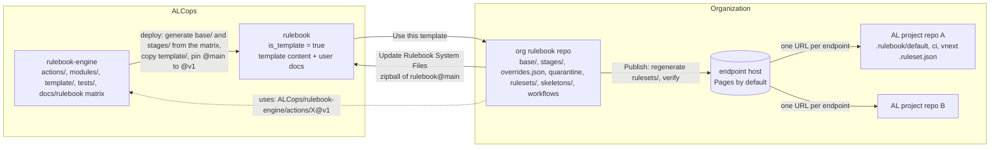
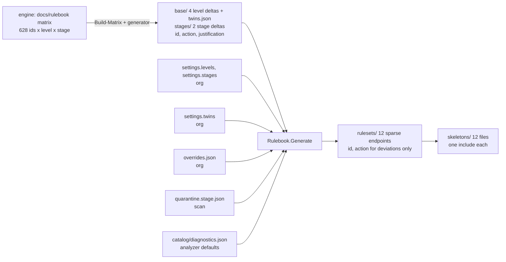
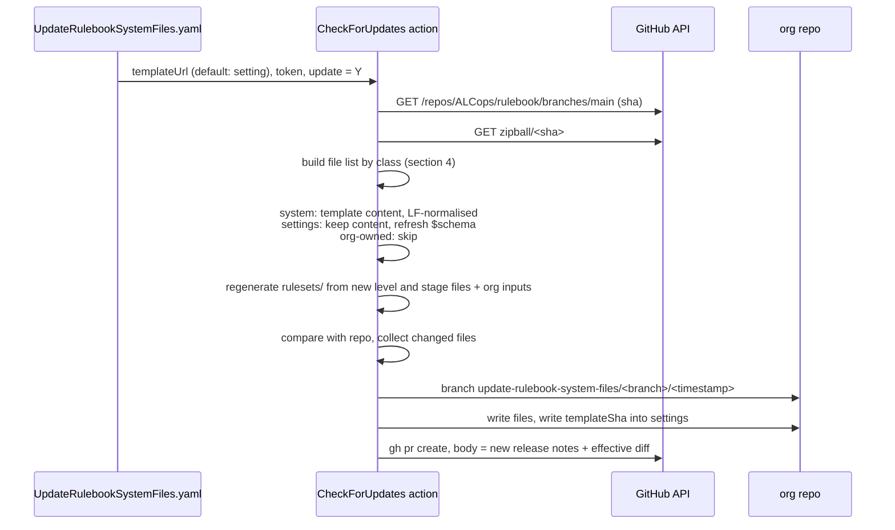
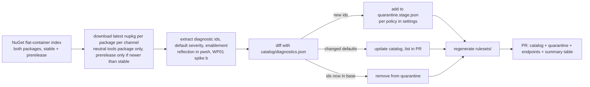
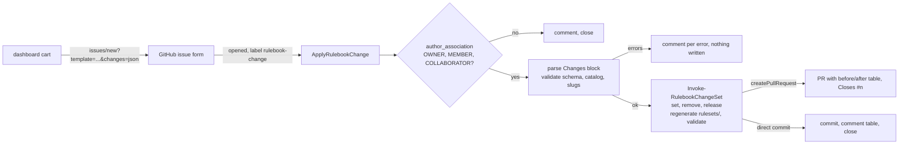

# Rulebook architecture

Target architecture of Rulebook: the repositories, the generation model of the ruleset files, the endpoints, the workflows that keep an org rulebook repo valid, published and current, the settings, the hosting targets and the failure model. The constraints come from how the AL compiler loads rulesets ([reference/compiler-ruleset-internals.md](reference/compiler-ruleset-internals.md)) and from how AL-Go updates system files ([reference/al-go-template-mechanics.md](reference/al-go-template-mechanics.md)).

> **Status:** target design after the requirements interviews of 2026-09-29, revised on 2026-10-01 when the target dimension was removed and endpoints became sparse (D21 to D24), and again on 2026-10-01 when the everything-off level was dropped, levels and stages became configuration and the source files became deltas (D25 to D30), and on 2026-10-03 when the dashboard and its issue-form write path were added (D31 to D37, design in [dashboard.md](dashboard.md)). Decisions are recorded in [adr/README.md](adr/README.md), the implementation is broken down into [work package issues](https://github.com/ALCops/rulebook-engine/issues?q=is%3Aissue+label%3Aworkpackage). The level content itself is specified in [rulebook/README.md](rulebook/README.md). Names of files and settings keys are the proposal that WP02 finalises.

---

## Contents

1. [Purpose and requirements](#1-purpose-and-requirements)
2. [Principles](#2-principles)
3. [Repository topology](#3-repository-topology)
4. [Org rulebook repo layout](#4-org-rulebook-repo-layout)
5. [Generation model](#5-generation-model)
6. [Endpoints and skeletons](#6-endpoints-and-skeletons)
7. [Workflows](#7-workflows)
8. [Settings](#8-settings)
9. [Hosting targets](#9-hosting-targets)
10. [Failure model and operational risks](#10-failure-model-and-operational-risks)
11. [Open decisions](#11-open-decisions)
12. [References](#12-references)
13. [Appendix: quick reference](#13-appendix-quick-reference)

---

## 1. Purpose and requirements

Rulebook gives an organization one place to decide which analyzer diagnostic is shown at which severity for its AL projects, publishes those decisions as URLs, and automates the chores around it: validation, publishing, adopting new analyzer rules, changing a rule, and updating the automation itself.

The requirements as gathered on 2026-09-29:

| # | Requirement | Where it lands |
|---|---|---|
| R1 | Endpoints: URLs to put in `al.ruleSetPath`, the AL-Go `rulesetFile`, or the single include of the project skeleton. | Section 6, WP04, WP05 |
| R2 | Private source repo, public endpoint files. | Section 9, WP05 |
| R3 | Skeleton files per endpoint to copy into an AL project, with local exceptions. | Section 6.3, WP06 |
| R4 | "Use this template": every org gets its own Rulebook. | Section 3, WP00, WP04 |
| R5 | An update action like AL-Go's, preserving the org's own changes. | Section 7.3, WP07 |
| R6 | Starting points: everything opted out, or a best-practice level. | Section 5.1, WP10; everything-off is an org-added root level (D25) |
| R7 | "Keep the best practice updated for me." | D3, vendored level and stage files plus update workflow, WP07, WP10 |
| R8 | Multiple levels, extensible. | Section 5.1, D26 (levels and stages are configuration) |
| R9 | Daily scan of the compiler and ALCops packages, auto opt-out of new ids per stage. | Section 7.4, WP08 |
| R10 | Guided opt-in and opt-out of a rule without hand-editing files. | Section 7.5, WP09 |
| R11 | AL-Go walkthrough, Azure DevOps documentation. | WP11 |
| R12 | A dashboard where a maintainer changes rules by clicking, without editing JSON and without any component outside GitHub (added 2026-10-03). | Sections 6.4 and 7.6, [dashboard.md](dashboard.md), WP14, WP15 |
| Non-functional | Automated tests; Linux runners only. | D9, D12, WP12 |

## 2. Principles

1. **Stages are configuration; three ship.** `default` shows in the editor what the pipeline will show. `CI` must not block on diagnostics the team has consciously postponed. `vNext` previews what will hit `CI` next, including compiler future errors at Error. An org adds or removes stages in its settings; `default` always exists (D26).
2. **All analyzers always on, one ladder for everyone.** Every analyzer is enabled in every project, both Microsoft cops included, and every rule has one ladder regardless of whether the project is a per-tenant extension or an AppSource app (D21). The blockers of either cop run at their native severity; the project opts out of the side that does not apply, by disabling a cop, by `suppressWarnings` in `app.json`, or by a rule in its project ruleset file. Twins are resolved by one organization setting (D23).
3. **Levels are a ladder of deltas.** A level is `basedOn` another level and lists only what it changes; the first level is a delta on the analyzer defaults (D27). The shipped four are cumulative (matrix invariant I2); an org's own level may raise or lower anything, and nothing checks it against the level it is based on (D26).
4. **Central and managed, with exceptions at the edge.** The org repo decides, through one overrides file. An AL project may register exceptions in its local skeleton, never redefine the standard.
5. **Adopt new rules at your own pace.** A new diagnostic id is quarantined per the org's policy until a level file adopts it; `vNext` can show it before that.
6. **One flat, sparse file per endpoint.** Every endpoint is generated from the level chain, the stage delta and the org's inputs and lists the diagnostic ids whose action differs from the analyzer default. The compiler fetches one small file; there is no include chain and no merge semantics to reason about (D18, D22). The organization's catalog records the defaults the endpoint relies on, and the daily scan reports when an analyzer changes one (D24).
7. **Fail loudly.** An unreachable or broken endpoint makes the compiler fall back to its defaults with one diagnostic (AL1033). Validation before publish and a reachability check after publish are therefore part of the product, not an option.

## 3. Repository topology



| Repository | Role | Versioning |
|---|---|---|
| `ALCops/rulebook-engine` | Logic: composite actions, PowerShell modules, tests, contributor docs, the level matrix (`docs/rulebook/`) and the `template/` source folder. | Branch `v1` (and later `v2`) receives releases; `main` is development. Org workflows reference `@v1`. |
| `ALCops/rulebook` | The template. Default branch `main` is what "Use this template" copies and what the update workflow downloads. | `main` = latest. Optional version branches later, AL-Go style (`templateUrl@branch`). |
| org rulebook repo | Created from the template. Holds the level and stage files, the org's overrides, quarantine, the generated endpoints and skeletons. Runs the five workflows. | The org's git history. |
| AL project repo | Holds one small skeleton file per stage that includes one endpoint and lists project exceptions. | Not managed by Rulebook. |

Why the engine is separate from the template: a template copy should contain only what an org needs, and a bug fix in an action must reach every org without an update PR. See D2.

## 4. Org rulebook repo layout

Everything an org repo contains after "Use this template". The **class** column is what the update workflow does with the file (section 7.3).

| Path | Content | Class |
|---|---|---|
| `.github/workflows/Validate.yaml` | On every pull request: schema, catalog coverage, regeneration check, effective diff report. Also runs the update check in check mode. | system |
| `.github/workflows/Publish.yaml` | On push to the default branch: validate, regenerate, commit, publish to the configured target, verify reachability. | system |
| `.github/workflows/UpdateRulebookSystemFiles.yaml` | Manual or scheduled: pull the latest template into a PR and regenerate. | system |
| `.github/workflows/ScanDiagnostics.yaml` | Daily: NuGet scan, catalog diff, quarantine PR with regenerated endpoints. | system |
| `.github/workflows/ChangeRule.yaml` | Manual form: one override entry, regenerate, open a PR. | system |
| `.github/workflows/ApplyRulebookChange.yaml` | On an issue with the `rulebook-change` label: gate on collaborator association, apply the change set, regenerate, open a PR or commit (section 7.6). | system |
| `.github/ISSUE_TEMPLATE/rulebook-change.yml`, `config.yml` | The issue form the dashboard prefills; blank issues stay enabled. | system |
| `.github/Rulebook-Settings.json` | Template URL and sha, base URL, publish target, quarantine policy, twins setting, the ordered `levels` (name, `basedOn`, description) and `stages` (name, description). | settings (kept, `$schema` refreshed) |
| `.github/RELEASENOTES.copy.md` | Release notes of the installed template version; source of the update PR body. | system |
| `base/<level>.ruleset.json` (4 shipped files) | The level content as generated from the matrix in the engine. Each file is a delta: `essential` lists the ids that differ from the analyzer defaults, every other file lists the ids that differ from its `basedOn` level, with action and justification. Files for org-added levels live here too and are org-owned because the template does not ship them. | system |
| `stages/<stage>.json` (2 shipped files) | One delta per non-default stage, applied on top of every level's default result: `ci.json`, `vnext.json`. The `default` stage has no file. Org-added stages are org-owned. | system |
| `base/twins.json` | The PerTenantExtensionCop/AppSourceCop twin pairs the `twins` setting acts on (D23). | system |
| `overrides.json` | The org's rule changes with scope selectors (D19). | org-owned |
| `quarantine.<stage>.json` (one per stage, `quarantine.default.json` included) | Ids held back per stage, written by the scan. | org-owned |
| `catalog/diagnostics.json` | Every known diagnostic id with analyzer, package, default severity, enablement, first-seen version and channel (D24). | org-owned |
| `rulesets/<level>.ruleset.json` (default stage), `rulesets/<level>.<stage>.ruleset.json` (12 files in the shipped set) | The endpoints: generated from the level chain + stage delta + twins setting + overrides + quarantine, listing the ids whose effective action differs from the analyzer default, no includes. Committed. | generated (regenerated by Validate, Publish, Scan, ChangeRule and Update) |
| `skeletons/<level>.<stage>.ruleset.json` (12 files, the stage suffix always written, `strict.default` included) | Copy-paste files for AL projects with `{BASEURL}`; one include of the endpoint. | system (regenerated from settings) |
| `docs/`, `README.md` | The org's own notes; the template ships a README that explains the layout. | never touched after creation |
| `site/**` | The Hugo dashboard: configuration, content adapter, layouts, scripts (section 6.4). `site/data/` is gitignored and written at publish time. | customizable (D35): overwritten only when unchanged locally |

The `rulesets/` folder is flat and every endpoint is self-contained, so the whole set is relocatable to any host without editing a file.

## 5. Generation model

### 5.1 Inputs, precedence, outputs



| Input | Written by | Precedence |
|---|---|---|
| `overrides.json` | ChangeRule, or the org by hand | 1: an entry whose selectors match the endpoint wins. Most specific selector set first, last entry in the file on ties. |
| `twins` setting with `base/twins.json` | The org in the settings; the pair list by the engine | 2: with `appsource` the PerTenantExtensionCop side of every pair is `None`, with `pte` the AppSourceCop side; `both` (default) changes nothing. |
| `stages/<stage>.json` | The engine, from the matrix stage columns; org-added stages by the org | 3: for a non-default stage, replaces the level's action for every id the file mentions, provided the level result is defined and not `None` (a stage never activates a rule, S-4). |
| `base/<level>.ruleset.json` resolved through `basedOn` | The engine, from the matrix; org-added levels by the org | 4: the level chain. Walk from the root to the level; the last file that mentions the id wins. Undefined when no file on the chain mentions the id. |
| `quarantine.<stage>.json` | The daily scan | 5: `None` for ids no file on the chain mentions. Once a level file mentions the id, the chain wins and housekeeping removes the entry. |
| analyzer default | `catalog/diagnostics.json`; the scan, seeded by the template | 6: what an id gets when nothing above decides it. The catalog also decides whether an effective action is written at all (D22). |

Output per endpoint: every id from the union of the inputs whose effective action differs from its analyzer default, with that action, in inventory order, without justification (D22). The generator contract with entry formats and examples is [rulebook/composition.md](rulebook/composition.md).

Levels and stages are configuration (D26). The template ships four levels, Essential, Recommended, Strict and Complete, each `basedOn` the one before it, and three stages, `default`, `CI` and `vNext`. Every published level is one entry in `settings.levels` with a file `base/<slug>.ruleset.json`; every stage other than `default` is one entry in `settings.stages` with a file `stages/<slug>.json`. The slug is the lowercased name and is the only spelling used in file names, URLs, selectors and keys (D28). `basedOn` may name any level file, published or not (D29), and is only the starting point: the level's own file may set any id to any action, higher or lower than the level it is based on. Three recipes cover what the former fixed five-level set used to do:

- **Add a level.** Add `{ "name": "Paranoid", "basedOn": "Complete", "description": "..." }` to `settings.levels` and create `base/paranoid.ruleset.json` with the ids it changes. Three endpoints, three skeletons and a docs page appear on the next publish.
- **Rename a shipped level.** Shipped names are not edited; the shipped file name is the key the update workflow overwrites. Add `{ "name": "Baseline", "basedOn": "Essential" }` with an empty `base/baseline.ruleset.json`, remove the Essential entry. URLs change; this is the documented breaking change of a rename.
- **Everything off (R6).** Add a root level `{ "name": "Off" }` with `base/off.ruleset.json` listing every enabled-by-default catalog id at `None` (one-shot helper `New-RulebookOffLevel`, WP10), then opt in rule by rule with overrides scoped `levels: ["off"]`, or move to a shipped level. There is no shipped everything-off level (D25).

Removing an entry from `settings.levels` or `settings.stages` stops publishing it; the shipped file stays and can still be a `basedOn` target. Listing the file in `unusedRulebookFiles` stops the update from re-adding it (WP07).

### 5.2 Why this shape

From the compiler's load and merge behaviour ([reference/compiler-ruleset-internals.md](reference/compiler-ruleset-internals.md)):

1. Every included file is a separate HTTP fetch with a 15 second timeout, no cache and no retry; any failure discards the whole ruleset (AL1033).
2. Between sibling includes the strictest action wins and `None` never wins; a file's own rules beat its includes. A layer that must lower a rule has to be an ancestor.
3. An id the ruleset does not mention runs at the analyzer's default severity.

Consequences: with one flat file per endpoint there is one fetch (1) and no layer ordering to get right (2). Point (3) is used on purpose: the endpoint writes only the ids where the matrix deviates from the analyzer default and leaves the rest to the compiler, which keeps the file small and lets `suppressWarnings` work for those ids (D22). The price is that the level chain, the stage deltas, overrides, the twins setting and quarantine cannot be dropped in as files; they are folded in at generation time, which is why the org repo regenerates on every change and commits the result. The source files are deltas for the same reason the endpoints are sparse: nothing is repeated, and the generator computes the artifact (D27). The catalog records the defaults the endpoint relies on so that a changed default is visible in the scan PR (D24).

### 5.3 Validation rules

Enforced by the `Validate` action on every PR and before every publish:

The checks are numbered `C1` to `C14` so that WP02 and WP03 can reference them; the engine's own matrix checks keep their `V` numbers.

| # | Rule | Severity | Why |
|---|---|---|---|
| C1 | Every file in `base/`, `stages/`, `rulesets/` and `skeletons/` parses and matches its schema profile: delta (level and stage files, `justification` required), endpoint, skeleton. | error | Invalid JSON discards the whole ruleset at compile time. |
| C2 | No id twice in one file. | error | Compiler error `ERR_RuleSetHasDuplicateRules`. |
| C3 | No `includedRuleSets` and no `generalAction` in delta or endpoint files; a skeleton has exactly one include with action `Default`. | error | An include would reintroduce a fetch. |
| C4 | Rule `action` is one of Error, Warning, Info, Hidden, None. Never `Default`. | error | `Default` fails deserialisation. |
| C5 | Settings: `levels` and `stages` are non-empty ordered arrays; every name lowercases to `^[a-z0-9-]+$`; slugs are unique per array; `stages` contains `default`; every `basedOn` resolves to an existing `base/<slug>.ruleset.json` without a cycle; `twins` is `both`, `appsource` or `pte`; `quarantine.*` is `null` or a list of stage slugs; `baseUrl` has no trailing slash. | error | Every file name and URL is derived from these values. |
| C6 | Every published level has `base/<slug>.ruleset.json`; every non-default stage has `stages/<slug>.json`; `stages/default.json` does not exist. | error | The default stage is the level result; a file for it would be a second truth. |
| C7 | Every id in level files, stage files, `base/twins.json`, `overrides.json` and the quarantine files exists in `catalog/diagnostics.json`. | warning until the first scan, then error | Typos never reach an endpoint. |
| C8 | A stage entry whose id no published level enables. | warning | Dead entry; a stage never activates a rule. |
| C9 | A delta entry equal to what the chain already gives; a file in `base/` or `stages/` that no settings entry references and that is not in `unusedRulebookFiles`. | warning | Dead weight, or a level the org forgot to publish or exclude. |
| C10 | `overrides.json` selectors are lowercase level and stage slugs from the settings or `["*"]`; every entry has an action and a justification. | error | Silent no-ops are the failure mode of a selector typo. |
| C11 | No endpoint entry equals the catalog default of its id; exactly the `levels x stages` endpoints and skeletons exist, no others. | error | A listed default is dead weight; the index page and the AL projects rely on the names. |
| C12 | Regeneration check: `rulesets/` equals the generator's output for the current inputs. | error | The committed endpoint is the published endpoint. |
| C13 | A quarantine id that a level file now mentions. | warning | Housekeeping. |
| C14 | Every catalog entry has `defaultSeverity` and `enabledByDefault`; every pair in `base/twins.json` is one PTE id and one AS id. | error | The sparse rule and the twins step depend on them. |

The effective diff per endpoint against the previous commit is printed as a report on every PR, so reviewers see what changes in terms of rules, not JSON lines. There is no check that a level is at least as strict as the level it is based on: a team that sets a rule to `None` at a higher level has made a decision, not an error (D26), and the effective diff is where a reviewer sees it.

## 6. Endpoints and skeletons

### 6.1 URL scheme

```
<baseUrl>/rulesets/<level>.ruleset.json            default stage
<baseUrl>/rulesets/<level>.<stage>.ruleset.json    every other stage
```

| Segment | Values | Note |
|---|---|---|
| `baseUrl` | Setting, for example `https://contoso.github.io/rulebook` | Rendered into skeletons and docs, never into `rulesets/` files. |
| `level` | Lowercased `settings.levels[].name`: `essential`, `recommended`, `strict`, `complete` in the shipped set | Slug, `^[a-z0-9-]+$`. |
| `stage` | Lowercased `settings.stages[].name`: `ci`, `vnext` in the shipped set | Omitted for `default`. |

Examples: `rulesets/essential.ruleset.json`, `rulesets/recommended.ci.ruleset.json`, `rulesets/strict.vnext.ruleset.json`. The literal `default` is dropped only here, in `rulesets/`. Everywhere else it is written: `quarantine.default.json`, `skeletons/strict.default.ruleset.json`, `.rulebook/default.ruleset.json`, the selector `"stages": ["default"]`, the resolved key `strict.default`, the matrix column `Default`.

`levels x stages` endpoints, 12 in the shipped set. Each is self-contained; nothing else needs to be reachable. There is no segment for the kind of extension: a per-tenant project and an AppSource app use the same endpoint and opt out of the other cop's rules on their side (section 6.3).

### 6.2 Which endpoint for which consumer

| Consumer | Endpoint | Where it is set |
|---|---|---|
| VS Code | `<level>` (default stage) | `al.ruleSetPath` pointing at the project's `.rulebook/default.ruleset.json` |
| Pull request and release builds | `<level>.ci` | AL-Go `rulesetFile` in `.AL-Go/settings.json` or `.github/CICD.settings.json`; ALOps compile task |
| Next major build | `<level>.vnext` | AL-Go `.github/NextMajor.settings.json` |

### 6.3 Skeletons (R3)

A skeleton is the file an AL project copies. One per endpoint under `skeletons/`, regenerated from the settings by the publish action:

```json
{
  "name": "Rulebook Strict / CI",
  "description": "Includes the org endpoint. Add project exceptions to rules; they override the endpoint.",
  "includedRuleSets": [
    { "action": "Default", "path": "https://contoso.github.io/rulebook/rulesets/strict.ci.ruleset.json" }
  ],
  "rules": []
}
```

This is the only include in the whole model: one fetch, and the skeleton's own `rules` beat the endpoint because a file's own rules overwrite its includes. Recommended location in the AL project: one file per stage, `.rulebook/default.ruleset.json`, `.rulebook/ci.ruleset.json`, `.rulebook/vnext.ruleset.json` (O6, closed by D28). A project that needs no exceptions can point straight at the endpoint URL instead; `al.ruleSetPath` and AL-Go's `rulesetFile` both accept a URL.

Opting out of rules written for the other kind of extension (a per-tenant project on AS0084, an AppSource app on PTE0001) has three routes, documented for users in the template's `docs/pte-or-appsource.md`: disable a cop in `al.codeAnalyzers`; list the ids in `suppressWarnings` of `app.json`, which works for every id the endpoint does not list because the compiler merges it strictest-wins after the ruleset and the endpoint is sparse (D22); or add the ids to the skeleton's `rules`, which works for every id, listed or not. Exceptions to rules the endpoint lists always go into the skeleton's `rules`.

### 6.4 Dashboard site (R12)

When `site.enabled` is true the Publish action builds the Hugo site in `site/` and deploys it as the root of the same host that serves `rulesets/`: `<baseUrl>/` is the matrix, `<baseUrl>/rules/<id>/` one page per rule, `<baseUrl>/rulebook.json` the data the site is built from. The site is in the template so an organization can adapt it; it replaces the plain `index.html` of WP05 when enabled, and the `pages` and `azure-blob` targets are the ones that can serve it (D31).

The matrix shows every catalog id as a row, every published level as a column and one stage at a time, with the effective action and the input that decided it (override, twins, stage, level, quarantine, analyzer default). Clicking a cell adds a change to a cart; the cart opens a prefilled issue form in the organization repository (section 7.6). The site reflects the default branch only, and by default omits the organization's free-text justifications because a Pages site is public outside Enterprise Cloud (D36). The full design is in [dashboard.md](dashboard.md).

## 7. Workflows

All six workflows run on `ubuntu-latest` and call composite actions from `ALCops/rulebook-engine/actions/<Name>@v1`. Write operations (branches, PRs) use the `GHTOKENWORKFLOW` secret in AL-Go's format (GitHub App JSON preferred, PAT accepted); `GITHUB_TOKEN` stays read-only (O4).

### 7.1 Validate

Trigger: `pull_request`, and called by Publish. Runs the rules of section 5.3, prints the effective diff per endpoint as a job summary, and runs the update check in check mode (warning "updates available", never writes).

### 7.2 Publish

Trigger: push to the default branch, `workflow_dispatch`. Steps: validate, regenerate `rulesets/` and commit if anything changed, render skeletons and an `index.html` listing every endpoint, publish `rulesets/` and `skeletons/` to the configured target, then `GET` every endpoint and fail if any is unreachable or differs from the source.

### 7.3 Update Rulebook System Files (R5)

Trigger: `workflow_dispatch` (inputs `templateUrl`, `downloadLatest`, `directCommit`), optional schedule via settings. Port of AL-Go's `CheckForUpdates`:



The shipped level files in `base/`, the shipped stage files in `stages/` and `base/twins.json` are overwritten with the template version; `overrides.json`, the quarantine files, the catalog, the org's own level and stage files and the settings values are never touched; `rulesets/` is regenerated so the PR shows the effective change of the new content under the org's overrides. The update also rewrites the `levels` and `stages` choice lists of `ChangeRule.yaml` from the settings (D30). For `Rulebook-Settings.json` the org's content stays, only `$schema` is refreshed and `templateSha` is written. Files the org added and the template does not know are never touched. Files the template removed are removed only if they were system files. `site/**` is the one **customizable** class (D35): a file is overwritten only when the org's copy equals the template version at the installed `templateSha`; a locally changed file is kept and listed in the PR body, with `site.updateMode: "overwrite"` as the opt-out.

### 7.4 Scan diagnostics (R9)

Trigger: daily schedule, `workflow_dispatch`.



Extraction loads the analyzer DLLs by reflection in pwsh: `Microsoft.Dynamics.Nav.CodeAnalysis.dll` and the four Microsoft cops from `tools/<tfm>/any/` of the tools package, the ALCops cops from `lib/<tfm>/` of `ALCops.Analyzers`, with `<tfm>` the highest folder not newer than the pwsh runtime (`net10.0` on `ubuntu-latest` today) and never `netstandard2.1`, one pwsh process per package version and channel. Only the platform-neutral tools package is downloaded, and a prerelease counts only when it sorts after the stable version; see [spike (b)](reference/spikes/b-analyzer-dll-extraction.md).

Policy from settings: `quarantine.stages` receives ids first seen in a stable package, `quarantine.prereleaseStages` receives ids first seen in a prerelease package. Both are mandatory (D14). Values are stage slugs from `settings.stages`. A typical choice: stable ids to `default` and `ci`, prerelease ids to `default` and `ci` as well, so `vnext` shows everything at default severity. A stage the org adds gets its own `quarantine.<slug>.json` the first time the scan writes to it. Ids never leave the catalog; the catalog records `firstSeenVersion`, `firstSeenChannel` and `lastSeenVersion`, so a rule that disappears from a package is visible too.

The catalog also records `defaultSeverity` and `enabledByDefault` per id (D24). When a package changes one, the scan updates the catalog, lists the change in the PR body ("LC0015: default Info -> Warning"), and regenerates the endpoints: an id whose level action now equals the new default drops out of the endpoint, an id whose default moved away from the level action is written. The reviewer sees the effective change per endpoint.

### 7.5 Change rule (R10)

Trigger: `workflow_dispatch` with a form.

| Input | Type | Values |
|---|---|---|
| `ruleId` | string | `AA0001`, `LC0029`, ... validated against the catalog |
| `action` | choice | Error, Warning, Info, Hidden, None, Remove |
| `levels` | choice | the level slugs from the settings and `*`; the choice list is rewritten by the update workflow (D30) |
| `stages` | choice | the stage slugs from the settings and `*`; same mechanism |
| `justification` | string | stored with the override entry |

The action writes or removes one entry in `overrides.json`, regenerates `rulesets/`, runs validation, and opens a PR whose body shows the effective change per endpoint (before and after). Changing the shipped level content itself is done in the engine, in the matrix, and reaches orgs through the update workflow; an org edits its own level and stage files by hand. The same action is callable from a future web UI or VS Code extension because its inputs are plain strings.

### 7.6 Apply change set (R12)

Trigger: `issues` with types `opened` and `edited`, job condition on the `rulebook-change` label. The dashboard's cart opens the issue form `rulebook-change.yml` prefilled with a change set through query parameters; the maintainer submits it with their own GitHub session, which is the only credential in the path (D32).



A change set is `{ version, note?, changes[] }` with `set` (write an override entry), `remove` (delete one) and `release` (remove an id from the quarantine of the listed stages). It is applied all or nothing, regenerated once, and lands per `commitOptions.createPullRequest` as one PR or one commit (D33). The gate is collaborator association (D34); justification is optional (D37). ChangeRule (section 7.5) builds a one-item change set and calls the same module function. Details, schema and the comment protocol are in [dashboard.md](dashboard.md) sections 6 to 8.

## 8. Settings

`.github/Rulebook-Settings.json`, draft for WP02:

```json
{
  "$schema": "https://raw.githubusercontent.com/ALCops/rulebook-engine/v1/schemas/rulebook-settings.schema.json",
  "templateUrl": "https://github.com/ALCops/rulebook@main",
  "templateSha": "",
  "baseUrl": "https://contoso.github.io/rulebook",
  "publish": { "target": "pages" },
  "twins": "both",
  "quarantine": { "stages": null, "prereleaseStages": null },
  "levels": [
    { "name": "Essential",   "description": "Cannot ship without: runtime failures, the deployment blockers of both Microsoft cops, compiler future errors, PlatformCop." },
    { "name": "Recommended", "basedOn": "Essential",   "description": "Every default-on rule at its author severity; marketplace checks join here." },
    { "name": "Strict",      "basedOn": "Recommended", "description": "Recommended with advisory rules promoted to Warning." },
    { "name": "Complete",    "basedOn": "Strict",      "description": "Strict plus every opt-in rule." }
  ],
  "stages": [
    { "name": "default", "description": "Editor and any consumer without its own stage. The level result as is." },
    { "name": "CI",      "description": "Pull request and release builds. Postponable diagnostics relaxed to Info." },
    { "name": "vNext",   "description": "Builds against the next platform. Future errors at Error, obsolete-pending at Warning." }
  ],
  "ghTokenWorkflowSecretName": "GHTOKENWORKFLOW",
  "commitOptions": { "createPullRequest": true, "pullRequestLabels": ["rulebook"] },
  "site": { "enabled": true, "includeJustifications": false, "updateMode": "skip" }
}
```

`publish.target` selects one of `pages`, `dist-repo` (with `repository`, `branch`), `azure-blob` (with `storageAccount`, `container`, OIDC login) or `gist` (with `gistId`). `quarantine` ships **without** values in the template; the scan fails until the org sets them. `twins` is `both` (default; the only valid choice when projects run just one of the two Microsoft cops), `appsource` or `pte` (D23).

`site` (D31, D35, D36): `enabled` builds and publishes the dashboard (default true; ignored with a warning for `dist-repo` and `gist`); `includeJustifications` publishes the organization's override and quarantine justification text (default false); `updateMode` is `skip` (keep locally changed site files on update) or `overwrite`.

`levels` and `stages` (D26, D28, D29):

- Both are ordered arrays of `{ name, description }`; a level may carry `basedOn`. Array order is presentation order (index page, docs, the ChangeRule dropdowns), nothing more.
- Identity is the `name`. The slug is the lowercased name, must match `^[a-z0-9-]+$` (no spaces) and must be unique within its array. The slug is used in every file name, URL, selector value and JSON key; the name keeps its casing in prose, in the `name` property of generated files and on the index page.
- A level entry is published: its endpoints, skeletons and docs page are generated. Its file is `base/<slug>.ruleset.json` and must exist; an empty `rules` array is valid (an alias).
- `basedOn` names any level file by name, whether or not that level is published. No cycles. A level without `basedOn` is a root and is a delta on the analyzer defaults. `basedOn` is only the starting point: the file may set any id to any action, higher or lower than the level it is based on, and nothing compares the two.
- `stages` must contain `default`. Every other stage has `stages/<slug>.json`. `default` has no file and is the only stage without a suffix in the endpoint URL (section 6.1).
- Shipped names are not edited; the recipes in section 5.1 cover renaming, adding and removing. A removed entry stops publishing; the shipped file stays until it is listed in `unusedRulebookFiles`.

## 9. Hosting targets

| Target | How the publish action works | Plan and privacy notes |
|---|---|---|
| GitHub Pages (default) | `actions/upload-pages-artifact` and `actions/deploy-pages` with `rulesets/`, `skeletons/`, `index.html`. Custom domain supported. | Public repo: every plan. Private repo with a public site: GitHub Pro, Team or Enterprise Cloud (per GitHub docs, not observed); a private site needs Enterprise Cloud. Spike WP01 (d) [confirmed](reference/spikes/d-pages-private-repo.md) the Free rule and found that the org member privilege "Pages creation" must be on and that the site must be enabled once before the first deploy. |
| Public dist repo | Push the same folders to a separate public repository; endpoints are `https://raw.githubusercontent.com/<org>/<dist>/main/rulesets/...`. | Any plan. Source repo can be private. |
| Azure Blob Storage | `az storage blob upload-batch` after OIDC login; container with anonymous read. | Any plan. Fits teams that already host artifacts in Azure. |
| Gist | Update the gist files through the API; endpoints are the gist raw URLs. | Bound to one personal account, no custom domain. Documented, not recommended. |

With `site.enabled` the staging root also holds the Hugo output (section 6.4), so the dashboard is as public as the endpoints: on `pages` that is a public site on every plan for a public repository and on Pro or Team for a private one; a private site needs Enterprise Cloud. `azure-blob` needs static website hosting on the storage account. `dist-repo` and `gist` cannot serve the site and fall back to the plain index.

Every target ends with the same reachability check: `GET` each endpoint, compare with the source, fail the run on any difference. The compiler goes through Microsoft's anti-SSRF policy when fetching; public hosts are expected to pass, which WP01 spike a confirms for `github.io` and `raw.githubusercontent.com`.

## 10. Failure model and operational risks

| Situation | Effect at compile time | Mitigation |
|---|---|---|
| Endpoint unreachable, invalid JSON, invalid enum, timeout | Whole ruleset discarded, compiler defaults in effect, one diagnostic AL1033. Because the matrix follows the analyzer defaults for most rules (D21) and the endpoint only lists deviations (D22), the fallback is close to the intended ruleset; what is lost is every `None` the level set, every downgrade, and the org's overrides, so a build can go red on rules the level had switched off. | Validate before publish, reachability check after publish, treat AL1033 as a hard failure in pipelines (documented in WP11). One fetch per compile keeps the exposure to one request. |
| External rulesets disabled in the consumer | AL0767, compiler defaults. | Walkthroughs set `enableExternalRulesets` in every consumer. `alc` defaults to disabled. |
| Endpoint committed but stale (inputs changed, not regenerated) | Consumers get yesterday's decision. | Regeneration check in Validate; every writing workflow regenerates. |
| Override selector typo | Silent no-op. | Selector validation; the ChangeRule PR body shows before and after per endpoint. |
| Update PR overwrites an org edit in a system file | Edit lost. | File classes; org decisions live only in `overrides.json`; docs say which files are system files. |
| Scan adds an id the org wanted to see | Rule hidden until adopted. | Policy is explicit per org; the PR lists every new id with its default severity and docs link. |
| VS Code does not re-fetch a changed remote file | Developers see stale rules until reload. | Documented; WP01 spike e records the exact behaviour. |
| Token missing or expired | Update, scan and change-rule PRs fail. | Same message pattern as AL-Go; GitHub App recommended. |
| A stranger opens a `rulebook-change` issue on a public repository | None at compile time; a workflow run. | Collaborator gate before parsing (D34); the issue is closed with a comment. |
| A cart exceeds the URL length GitHub accepts | The issue form opens empty or the request fails. | The cart shows its size against the measured limit and offers split and copy (spike WP01 (g)). |
| An organization adapted `site/` and the template changed the same file | Dashboard fix not applied. | Customizable class skips and lists the file in the update PR (D35); `site.updateMode: "overwrite"` forces it. |

> **Contested.** Observed 2026-10-03 in spike (c): on the `alc` command line a failing root ruleset URL aborts the compile with exit 1 (AL0767, AL1033) instead of falling back to defaults; spike (a) checks the include case. See [spikes/c-alc-on-ubuntu.md](reference/spikes/c-alc-on-ubuntu.md).

## 11. Open decisions

See the open decisions table in [adr/README.md](adr/README.md): O3 engine pinning, O4 secret name. O1 and O2 are closed by D19; O5 (third target name) is moot since D21; O6 (files per AL project) is closed by D28: one skeleton per stage.

## 12. References

- [reference/compiler-ruleset-internals.md](reference/compiler-ruleset-internals.md): schema, load pipeline, merge algorithm, paths and URLs, failure model, consumer flags.
- [reference/al-go-template-mechanics.md](reference/al-go-template-mechanics.md): template repositories, CheckForUpdates, customization preservation, GhTokenWorkflow.
- [rulebook/README.md](rulebook/README.md): the level content, matrix, placement algorithm and generator contract.
- [dashboard.md](dashboard.md): the dashboard site, data contract, change set, issue form and apply workflow.
- Microsoft Learn, ruleset syntax: https://learn.microsoft.com/dynamics365/business-central/dev-itpro/developer/devenv-rule-set-syntax-for-code-analysis-tools
- Microsoft Learn, AL extension configuration: https://learn.microsoft.com/dynamics365/business-central/dev-itpro/developer/devenv-al-extension-configuration
- NuGet, AL development tools: https://www.nuget.org/packages/Microsoft.Dynamics.BusinessCentral.Development.Tools (platform variants `.Linux`, `.Win`, `.Osx`)
- NuGet, ALCops analyzers: https://www.nuget.org/packages/ALCops.Analyzers
- ALCops analyzers documentation: https://alcops.dev/docs/analyzers
- ALCops discussion on new rules breaking pipelines: https://github.com/ALCops/Analyzers/discussions/405
- StefanMaron/RulesetFiles, a flat community ruleset layout served from raw GitHub URLs: https://github.com/StefanMaron/RulesetFiles
- GitHub Pages availability per plan: https://docs.github.com/en/get-started/learning-about-github/githubs-plans

## 13. Appendix: quick reference

### Naming

| Thing | Pattern | Example |
|---|---|---|
| Level file | `base/<level>.ruleset.json`, `base/twins.json` | `base/strict.ruleset.json` |
| Stage file | `stages/<stage>.json`, none for `default` | `stages/ci.json` |
| Endpoint | `rulesets/<level>.ruleset.json` (default stage), `rulesets/<level>.<stage>.ruleset.json` | `rulesets/strict.ruleset.json`, `rulesets/strict.ci.ruleset.json` |
| Overrides | `overrides.json` | |
| Quarantine | `quarantine.<stage>.json` | `quarantine.ci.json`, `quarantine.default.json` |
| Skeleton | `skeletons/<level>.<stage>.ruleset.json`, suffix always written | `skeletons/strict.ci.ruleset.json`, `skeletons/strict.default.ruleset.json` |
| AL project root | `.rulebook/<stage>.ruleset.json` | `.rulebook/ci.ruleset.json`, `.rulebook/default.ruleset.json` |
| Slug | lowercased `name`, `^[a-z0-9-]+$` | `vNext` becomes `vnext` |
| Update branch | `update-rulebook-system-files/<branch>/<yyMMddHHmmss>` | |
| Update PR title | `[<branch>@<sha7>] Update Rulebook System Files from ALCops/rulebook - <templateSha7>` | |
| Change branch | `rulebook-change/<issue>/<yyMMddHHmmss>` | |
| Dashboard | `<baseUrl>/`, `<baseUrl>/rules/<id>/`, `<baseUrl>/rulebook.json` | `https://contoso.github.io/rulebook/rules/AL0432/` |

### File classes for the update

| Class | Files | Update behaviour |
|---|---|---|
| system | workflows, the shipped level files in `base/`, the shipped stage files in `stages/`, `base/twins.json`, skeleton templates, release notes copy | Overwritten with template content. |
| settings | `Rulebook-Settings.json` | Content kept, `$schema` refreshed, `templateSha` written. |
| generated | `rulesets/` | Regenerated after every update from the new level and stage files and the org's inputs. |
| org-owned | `overrides.json`, quarantine files, catalog, level and stage files the org added, the org's own workflows and docs | Never touched. |
| customizable | `site/**` | Overwritten only when unchanged since the installed template version; otherwise kept and listed in the PR (D35). |

### Actions in the engine

| Action | Called by | Purpose |
|---|---|---|
| `Validate` | Validate.yaml, Publish.yaml | Section 5.3 rules, effective diff report, update check mode. |
| `Publish` | Publish.yaml | Regenerate, render skeletons and index, publish, verify. |
| `CheckForUpdates` | UpdateRulebookSystemFiles.yaml, Validate.yaml (check mode) | Section 7.3. |
| `ScanDiagnostics` | ScanDiagnostics.yaml | Section 7.4. |
| `ChangeRule` | ChangeRule.yaml | Section 7.5; one-item client of the change-set module. |
| `ApplyChangeSet` | ApplyRulebookChange.yaml | Section 7.6. |
