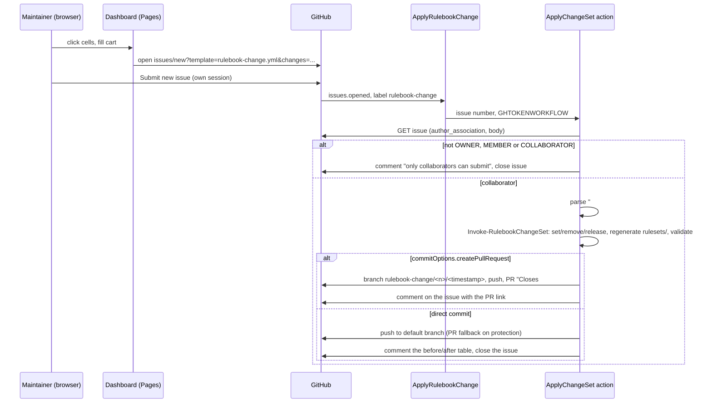

# Rulebook dashboard

Design of the dashboard an organization gets with its rulebook repository: a Hugo site, published next to the endpoints, that shows the matrix of diagnostic ids by level and stage, and a write path that turns clicks into a pull request without any infrastructure beyond GitHub. Contributor document; the user-facing page is `docs/dashboard.md` in `ALCops/rulebook` (WP11).

> **Status:** target design after the interview of 2026-10-03 (D31 to D37). Implemented by [WP14](https://github.com/ALCops/rulebook-engine/issues/16) (site) and [WP15](https://github.com/ALCops/rulebook-engine/issues/17) (write path). Names of files and settings keys are proposals that WP02 and WP14 finalise.

---

## Contents

1. [Problem and constraints](#1-problem-and-constraints)
2. [Interview outcome](#2-interview-outcome)
3. [Why this shape](#3-why-this-shape)
4. [Site](#4-site)
5. [Data contract](#5-data-contract)
6. [Change set](#6-change-set)
7. [Issue form](#7-issue-form)
8. [Apply workflow](#8-apply-workflow)
9. [Update behaviour for site files](#9-update-behaviour-for-site-files)
10. [Exposure](#10-exposure)
11. [Open questions](#11-open-questions)
12. [References](#12-references)

---

## 1. Problem and constraints

An organization edits its rulebook through JSON files: `overrides.json`, the quarantine files, `Rulebook-Settings.json`. Engineers manage; a team lead or consultant who owns the rulebook does not want to hand-edit JSON. The wish is a dashboard over the matrix (628 ids in the shipped set, 4 levels, 3 stages, 12 endpoints) where a maintainer clicks a cell and the change lands in the repository.

Constraints, in priority order:

1. **GitHub only.** No database, no hosted service, no third-party component an organization has to run. A custom username and password is rejected outright.
2. **No token handling by the user.** A pasted personal access token is a hurdle for the people the dashboard is for.
3. **Click, do not edit.** The result of a click is a commit or a pull request, through the same engine module every other change path uses.

Any page in a browser that writes to a repository needs a credential, and a static site cannot hold one. The credential can only come from a token the user holds, from the user's existing github.com session on a GitHub-owned page, or from a server holding a GitHub App secret. OAuth from a static page is not possible: GitHub's device flow and token endpoints send no CORS headers, so every "Sign in with GitHub" needs a proxy. With constraints 1 and 2 the only path left is the second: hand the user to a GitHub-owned page, prefilled, and let a workflow do the writing.

## 2. Interview outcome

Decisions taken by the owner on 2026-10-03:

| Topic | Decision | Logged as |
|---|---|---|
| Audience | Organization maintainers editing their own rulebook. Not the engine matrix, not per-project opt-outs. | D31 |
| Read side | An interactive matrix on the organization's published site, generated by Hugo at publish time. The whole site (config, layouts, scripts) ships in the template so an organization can adapt it. Optional through a setting. | D31 |
| Write side | A cart in the dashboard that opens a prefilled GitHub issue form. A workflow applies the change set. The only credential is the submitter's GitHub session. | D32 |
| Batching | Many changes, one issue, one pull request or commit. | D33 |
| Landing | Follows `commitOptions.createPullRequest` in the settings, like ChangeRule. | D33 |
| Permissions | Collaborators only: `OWNER`, `MEMBER`, `COLLABORATOR`. Anyone else gets a comment and the issue is closed. | D34 |
| Edit scope v1 | Rule actions as overrides, and releasing an id from quarantine. Not in v1: levels and stages configuration, org-owned level and stage files. | D32 |
| Update | Site files are a new file class: overwritten only when the organization has not changed them; a local change is kept and reported. | D35 |
| Exposure | The site is public outside Enterprise Cloud. By default it omits the organization's free-text justifications. | D36 |
| Justification | Optional in every change path. | D37 |
| Views v1 | The matrix grid with a stage switcher is the acceptance bar. Filters, a rule detail page and the cart are part of the design. | WP14 |
| Pending changes | Not shown. The site reflects the default branch; the issue and the pull request are where pending work lives. | WP14 |

## 3. Why this shape

Alternatives considered and why they lost, in one table (the detail is in D31 and D32):

| Alternative | Why not |
|---|---|
| Fine-grained PAT pasted into the page, stored in the browser | Token creation and rotation is exactly the hurdle the dashboard should remove; a leaked browser profile leaks repository write access. |
| OAuth or device flow with a small proxy (Cloudflare Worker, Azure Function) | Breaks "GitHub only"; every organization must deploy and operate it. |
| Hosted application with GitHub login (Azure Static Web Apps, alcops.dev with a backend) | Best UX, but either a non-GitHub component per organization or a central service ALCops has to run for everyone. |
| VS Code web extension through github.dev or Codespaces | GitHub only and no infrastructure, but the user has to open the repository in an editor; kept as a later entry point because it can call the same module. |
| Hand-off: the page renders the JSON and the user pastes it into GitHub's editor | Zero automation; stays as the fallback when a cart exceeds the URL limit. |
| Plain static HTML without a generator | Works, but Hugo renders the 628-row grid and one page per rule at build time, so the JavaScript stays small, and the publish action already runs on a runner where installing Hugo costs nothing for the organization. |

## 4. Site

### Layout in the template

```
site/
  hugo.yaml                  baseURL is passed on the command line; theme-less
  content/
    _index.md                the matrix page
    _content.gotmpl          content adapter: one page per rule from data/rulebook.json
  layouts/
    index.html               matrix grid rendered from hugo.Data.rulebook
    rules/single.html        rule detail page
    partials/                cell, legend, filters, cart
  assets/js/
    matrix.js                stage switcher, filters, provenance toggle
    cart.js                  cart state in localStorage, before/after, issue URL
  assets/css/site.css
  data/                      gitignored; written by the publish action
```

No Hugo theme and no Hugo modules, so no Go toolchain and no submodule. Everything the site needs is in these files. `site/**` is the only member of the **customizable** file class (section 9).

### Build

When `site.enabled` is true the Publish action (WP05):

1. Writes `site/data/rulebook.json` (section 5) from the catalog, the settings and the generator's resolved output.
2. Runs `hugo --source site --baseURL <baseUrl> --destination <staging>` with a Hugo version pinned in the engine action. Hugo 0.126 or later for content adapters; 0.156.0 or later for `hugo.Data` ([spike (h)](reference/spikes/h-hugo-content-adapter.md)).
3. Copies `rulesets/`, the rendered `skeletons/` and `catalog/diagnostics.json` into the same staging root, then publishes the staging root as today.

The site replaces the hand-written `index.html` of WP05. With `site.enabled` false the plain `index.html` is published, unchanged from WP05.

The site is meaningful for `publish.target: pages` and for `azure-blob` with static website hosting. For `dist-repo` and `gist` the setting is ignored with a warning: `raw.githubusercontent.com` and gist raw URLs serve HTML as `text/plain`.

### Views

| View | Content | Interaction |
|---|---|---|
| Matrix | One row per id, grouped by analyzer in inventory order; one column per published level in settings order; a stage switcher (tabs) above the grid. A cell shows the effective action and a provenance marker: plain for level or default, dot for stage, ring for twins, badge for override, badge for quarantine. | Click a cell: a popover with `Error`, `Warning`, `Info`, `Hidden`, `None` and `Reset` (remove the override that produced the cell). Choosing adds a cart item scoped to that level and the current stage, with "all levels" and "all stages" toggles. |
| Filters | Analyzer, action, provenance (`override`, `quarantine`, `stage`), free text on id and title. | Client-side, no reload. |
| Rule page | `rules/<id>/`: title, analyzer, default severity and enablement, docs link, the justification from the level and stage files, every endpoint's effective action with provenance. Generated by the content adapter so each rule has a stable URL. | The same popover as the matrix. |
| Cart | A side panel listing the pending items with the before and after per affected endpoint, an optional justification per item, an optional batch note, a count of bytes against the URL limit, and **Submit on GitHub**. Persisted in `localStorage`. | Submit opens the prefilled issue form (section 7) in a new tab and clears the cart when the user confirms. |
| Legend and help | What the markers mean, which stage the pipeline uses, a link to the user docs. | |

The matrix is rendered by Hugo as static HTML; JavaScript hides rows, switches the visible stage (all stages are rendered, one is shown), and manages the cart. There is no framework and no npm.

## 5. Data contract

`site/data/rulebook.json`, one file, written by `Export-RulebookSiteData` (WP14):

```json
{
  "generatedAt": "2026-10-03T12:00:00Z",
  "repository": "contoso/rulebook",
  "baseUrl": "https://contoso.github.io/rulebook",
  "issueTemplate": "rulebook-change.yml",
  "levels": [
    { "name": "Essential", "slug": "essential", "description": "..." },
    { "name": "Recommended", "slug": "recommended", "basedOn": "Essential", "description": "..." }
  ],
  "stages": [
    { "name": "default", "slug": "default", "description": "..." },
    { "name": "CI", "slug": "ci", "description": "..." }
  ],
  "rules": [
    {
      "id": "AL0432",
      "analyzer": "Compiler",
      "title": "Obsolete pending: replacement may not exist yet",
      "docsUrl": "https://learn.microsoft.com/...",
      "default": "Warning",
      "enabledByDefault": true,
      "justifications": { "recommended": "Replacement may not exist yet; advisory in CI, Warning on vNext where removal is near; F-05", "stage:ci": "Replacement may not exist yet; advisory in CI, Warning on vNext where removal is near; F-05" },
      "cells": {
        "essential.default": { "action": "None", "source": "level:essential" },
        "recommended.ci":    { "action": "Info", "source": "stage:ci" },
        "strict.ci":         { "action": "None", "source": "override" }
      }
    }
  ],
  "overrides": [
    { "id": "AL0432", "action": "None", "levels": ["strict"], "stages": ["ci"] }
  ],
  "quarantine": {
    "ci": [ { "id": "LC0099" } ]
  }
}
```

Rules:

- `cells` has one entry per published level and stage, keyed `<levelSlug>.<stageSlug>`, the `default` stage written. `source` is the input that decided the action in the precedence of ARCHITECTURE section 5.1: `override`, `twins`, `stage:<slug>`, `level:<slug>`, `quarantine`, `default`. The generator already walks that chain, so the export records which input won instead of recomputing it in the browser.
- `justifications` carries the level and stage justifications from the engine's files. They are public already (the engine repository is public) and are always included.
- `overrides[].justification` and `quarantine.<stage>[].justification` are written only when `site.includeJustifications` is true (D36).
- `rules` is in inventory order, unknown ids after the known ones sorted by id, the same order the endpoints use.
- Ids in the catalog that no level mentions and that are at their default appear with every cell at `default`, so the matrix shows the whole catalog, not only the deviations.

## 6. Change set

One JSON document, schema `schemas/rulebook-changeset.schema.json` in the engine:

```json
{
  "version": 1,
  "note": "Legacy tables; agreed in the architecture meeting of 2026-10-02",
  "changes": [
    { "op": "set",     "id": "LC0015", "action": "None",    "levels": ["strict"], "stages": ["ci"], "justification": "Tracked in DEV-1234" },
    { "op": "set",     "id": "AA0072", "action": "Warning", "levels": ["*"],      "stages": ["*"] },
    { "op": "remove",  "id": "AL0432", "levels": ["essential", "recommended"], "stages": ["ci"] },
    { "op": "release", "id": "LC0099", "stages": ["ci"] }
  ]
}
```

| `op` | Meaning | Engine call | Required fields |
|---|---|---|---|
| `set` | Write or replace an override entry with these selectors | `Set-RulebookOverride` (WP09) | `id`, `action`, `levels`, `stages`; `justification` optional (D37) |
| `remove` | Delete the override entry with exactly these selectors | `Remove-RulebookOverride` (WP09) | `id`, `levels`, `stages` |
| `release` | Remove the id from `quarantine.<stage>.json` for each listed stage | `Remove-RulebookQuarantine` (new, WP15) | `id`, `stages` (`*` allowed) |

Validation before anything is written: `version` is 1; every `id` matches `^[A-Z]{2,3}\d{4}i?$` and exists in `catalog/diagnostics.json`; every level and stage value is a slug from the settings or `*` (C10); `action` is one of the five actions; no two changes have the same `op`, `id` and selectors. A `set` whose result equals what the endpoint already has on every matching endpoint is a no-op: reported, not written (WP09 housekeeping). A `release` for a stage whose quarantine file does not contain the id is a no-op too.

A released id falls back to the level chain or the analyzer default on the next generation. The daily scan does not re-add it, because the catalog already records the id; quarantine is only for ids the catalog has never seen (WP08).

`note` and the per-change `justification` are optional everywhere. The note becomes the first paragraph of the pull request body; a justification is stored in the override entry.

## 7. Issue form

`template/.github/ISSUE_TEMPLATE/rulebook-change.yml`:

```yaml
name: Rulebook change
description: Apply a change set produced by the Rulebook dashboard. Submitting opens a pull request (or commits, per the settings).
title: "Rulebook change"
labels: [rulebook-change]
body:
  - type: markdown
    attributes:
      value: |
        The dashboard filled this form. Submit it as is; a workflow validates the change set, regenerates the endpoints and opens a pull request. Only repository collaborators can submit.
  - type: textarea
    id: changes
    attributes:
      label: Changes
      description: The change set, JSON. Edit only if you know the schema.
      render: json
    validations:
      required: true
  - type: textarea
    id: note
    attributes:
      label: Note
      description: Optional. Becomes the first paragraph of the pull request.
```

The dashboard opens

```
https://github.com/<owner>/<repo>/issues/new?template=rulebook-change.yml&changes=<urlencoded change set>&note=<urlencoded note>
```

GitHub prefills issue form fields from query parameters named after the field `id`. The user sees the filled form, can read the JSON, and clicks "Submit new issue" with their own GitHub session. `repository` and `issueTemplate` come from the data file, so an organization that renames the template or the repository changes one setting.

**URL limit.** GitHub answers `414 URI Too Long` once the full prefilled URL reaches 8192 bytes; 8191 bytes still opens the form with every field filled byte-identical, `render: json` included ([spike (g)](reference/spikes/g-prefilled-issue-url-limit.md), Edge 154; Chrome assumed equivalent, Firefox not tested). The cart serializes the change set minified, measures the full URL it opens and shows it against 7372 bytes (90 % of the threshold), which holds about 28 changes with a justification or 46 without. Logged-out users were not tested in a browser: GitHub re-encodes the whole URL into the login redirect's `return_to`, and anonymous requests already failed there from about 7 KB, so a user who is not signed in may hit a limit earlier. When a cart exceeds it the dashboard offers two routes: split the cart into several submissions, or copy the change set to the clipboard and paste it into the empty form. No compact encoding (`LC0015=None@strict/ci`): it would fit about 228 changes but drops justifications and needs a second parser.

`.github/ISSUE_TEMPLATE/config.yml` keeps `blank_issues_enabled: true`: organizations use issues for other things.

## 8. Apply workflow

`template/.github/workflows/ApplyRulebookChange.yaml`:

```yaml
on:
  issues:
    types: [opened, edited]
jobs:
  apply:
    if: contains(github.event.issue.labels.*.name, 'rulebook-change')
    runs-on: ubuntu-latest
    permissions:
      contents: read
      issues: write
    steps:
      - uses: actions/checkout@v4
      - uses: ALCops/rulebook-engine/actions/ApplyChangeSet@v1
        with:
          issueNumber: ${{ github.event.issue.number }}
          token: ${{ secrets.GHTOKENWORKFLOW }}
```



Rules:

- The gate uses `author_association` from the issue payload. `CONTRIBUTOR`, `FIRST_TIMER`, `FIRST_TIME_CONTRIBUTOR` and `NONE` are refused. On a public repository this is the only thing between a stranger and a workflow run, so the gate runs before the body is parsed.
- Issue forms render each field as `### <label>` followed by the value; a `render: json` textarea arrives as a fenced block. The parser takes the fenced block under `### Changes` and the paragraph under `### Note`; anything else in the body is ignored.
- Every failure is one comment on the issue naming the offending change and the reason (`LC9999: unknown id`, `paranoid: not a level in the settings`, `AA0072 at Warning on recommended.default: no-op`). Nothing is written when any change fails; the change set is applied as a whole or not at all.
- `edited` re-runs the whole thing, so a submitter can fix a rejected change set in place. A second run while a PR for the same issue is open comments "pull request already exists" and stops.
- Branch `rulebook-change/<issue>/<yyMMddHHmmss>`, PR title = issue title, body = note, the before/after table in the WP09 format with one row per changed endpoint, provenance, and `Closes #<issue>`. Direct commit falls back to a PR when branch protection rejects the push (as WP07).
- `GITHUB_TOKEN` is read-only on contents and may only comment and close issues; every write uses `GHTOKENWORKFLOW`, exchanged as in WP07.
- `ChangeRule` (WP09) stays as the second entry point for a single rule without a browser session on the site. It builds a one-item change set and calls the same `Invoke-RulebookChangeSet`; its `justification` input becomes optional (D37).

## 9. Update behaviour for site files

`site/**` is the **customizable** file class (D35, WP07). The update compares three versions of every file: the organization's file, the template version at the installed `templateSha` (the old template), and the template version being installed (the new template).

| Organization vs old template | New vs old template | Result |
|---|---|---|
| equal | changed | overwrite, as a system file |
| differs | equal | keep, no diff: the template did not touch it |
| differs | changed | **skip**: keep the organization's file, list it under "Skipped: local changes" in the PR body with a link to the template diff |
| absent | new | add |
| any | removed | remove only when listed in `unusedRulebookFiles`, as for system files |

The old template is one extra zipball download at `templateSha`; when `templateSha` is empty (first run) every differing file counts as a local change and is skipped with a note. `site.updateMode: "overwrite"` turns the class into plain system files for organizations that never customise. Workflows, the issue form and the schemas stay in the overwrite class, so the choice-list rewrite of D30 and the apply workflow are always current.

## 10. Exposure

Outside GitHub Enterprise Cloud a Pages site is public: public repository on every plan, private repository with a public site on Pro and Team. The endpoints are public already in every hosting target (the compiler fetches anonymously, D7), so the site adds only what the endpoints do not carry:

| Data | On the site by default | Why |
|---|---|---|
| Effective action per id and endpoint | yes | Equals the endpoints plus the analyzer defaults |
| Provenance (`override`, `quarantine`, `stage`, ...) | yes | Reveals that an organization deviates, not why |
| Level and stage justifications from the engine | yes | Public in the engine repository |
| Override justification text | **no** | Free text written by the organization; `site.includeJustifications: true` publishes it |
| Quarantine justification text | **no** | Same, and it names package versions and dates |
| Open issues and pull requests | no | The site reflects the default branch; GitHub shows pending work |

An organization that wants none of it sets `site.enabled: false` and keeps the WP05 index page. There is no other access control; a password-protected page was rejected in the interview.

## 11. Open questions

| # | Question | Proposal | Closed by |
|---|---|---|---|
| Q1 | Measured URL limit for a prefilled issue, and whether a compact encoding is needed | 414 from 8192 bytes of full URL; the cart enforces 7372 bytes (90 %), minified JSON, split and copy fallback; no compact encoding ([spike (g)](reference/spikes/g-prefilled-issue-url-limit.md)) | WP01 (g), WP14 |
| Q2 | Should `release` also accept an `action`, so releasing and setting an override is one change? | No: two changes in one cart do the same and keep the schema flat | WP15 |
| Q3 | Should the apply workflow run Validate on the branch before opening the PR? | Yes, same as the WP07 proposal; cheap with WP03 | WP15 |
| Q4 | Which Hugo version to pin, and whether to vendor the binary in the engine or download it | Pin Hugo 0.167.0 extended (latest stable on 2026-10-03; floor 0.156.0 for `hugo.Data`, per release note), download the `.deb` with checksum, no vendoring: install about 3 s, build under 1 s at 628 rules ([spike (h)](reference/spikes/h-hugo-content-adapter.md)); re-pin to the latest stable at WP14 time | WP01 (h), WP14 |
| Q5 | Whether the matrix should also be exported as a standalone JSON for other tooling (VS Code extension later) | Yes: `rulebook.json` is already published next to `catalog/diagnostics.json` | WP14 |

## 12. References

- [ARCHITECTURE.md](ARCHITECTURE.md) sections 4, 6.4, 7.3, 7.6, 8 and 9.
- [adr/README.md](adr/README.md) D7, D11, D19, D30, D31 to D37.
- Work package issues [WP14 (#16)](https://github.com/ALCops/rulebook-engine/issues/16), [WP15 (#17)](https://github.com/ALCops/rulebook-engine/issues/17), [WP07 (#9)](https://github.com/ALCops/rulebook-engine/issues/9), [WP09 (#11)](https://github.com/ALCops/rulebook-engine/issues/11).
- GitHub, creating an issue from a URL with query parameters (issue form fields can be prefilled): https://docs.github.com/en/issues/tracking-your-work-with-issues/using-issues/creating-an-issue#creating-an-issue-from-a-url-query
- GitHub, syntax for issue forms: https://docs.github.com/en/communities/using-templates-to-encourage-useful-issues-and-pull-requests/syntax-for-issue-forms
- GitHub, `author_association` values: https://docs.github.com/en/graphql/reference/enums#commentauthorassociation
- Hugo content adapters: https://gohugo.io/content-management/content-adapters/
- GitHub Pages visibility per plan: https://docs.github.com/en/get-started/learning-about-github/githubs-plans
