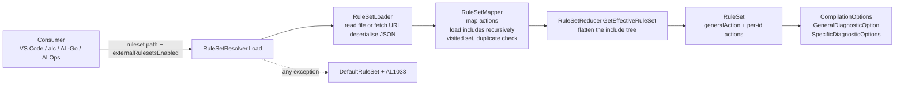

# AL compiler ruleset internals

Reference description of how the AL compiler loads, merges and fails on ruleset files, taken from the NAV SDK source. Every design choice in Rulebook (one flat file per endpoint, only deviations from the analyzer default listed, one include in the project skeleton, one fetch per compile) follows from the rules described here, so this document is the place to re-check a claim against a newer SDK.

> **Status:** reference. Observed in assembly `Microsoft.Dynamics.Nav.CodeAnalysis`, namespace `Microsoft.Dynamics.Nav.CodeAnalysis.DiagnosticRules`, `net8.0` and `net10.0` builds (same logic). File names are given so the behaviour can be re-checked. Last verified 2026-09-29; the `suppressWarnings` merge (section 8) re-verified 2026-10-01 against `CommandLineParser.cs` lines 543 to 558, `CompilationOptions.cs` lines 107 to 158 and `VsCodeWorkspace.cs` lines 400 and 413.

---

## Contents

1. [Purpose and scope](#1-purpose-and-scope)
2. [Schema as the code accepts it](#2-schema-as-the-code-accepts-it)
3. [Load pipeline](#3-load-pipeline)
4. [Merge algorithm](#4-merge-algorithm)
5. [Include action semantics](#5-include-action-semantics)
6. [Paths and URLs](#6-paths-and-urls)
7. [Failure model](#7-failure-model)
8. [How the ruleset combines with other inputs](#8-how-the-ruleset-combines-with-other-inputs)
9. [Consumer flags](#9-consumer-flags)
10. [Design consequences](#10-design-consequences)
11. [What this means for Rulebook](#11-what-this-means-for-rulebook)
12. [References](#12-references)
13. [Appendix: quick reference](#13-appendix-quick-reference)

---

## 1. Purpose and scope

A ruleset file maps diagnostic ids to severities and can include other ruleset files, by local path or by URL. The compiler flattens that tree into one effective ruleset before compiling. The merge is not "last one wins" and not "first one wins"; it is strictest-wins between siblings and own-rules-win over includes. Getting this wrong produces a build that silently runs with different severities than intended, or, on any error, with no ruleset at all.

This document covers:

- the schema exactly as the code deserialises it,
- the load pipeline and the merge algorithm, with a worked example,
- include action semantics, path resolution, fetching and the failure model,
- how the ruleset combines with `alc` switches and `app.json`,
- the flags each consumer (VS Code, `alc`, AL-Go, BcContainerHelper, ALOps, AL MCP) exposes,
- the consequences for Rulebook's generation model.

Per-rule decisions are out of scope.

---

## 2. Schema as the code accepts it

`ExternalRuleSet.cs`, `ExternalIncludedRuleSet.cs`, `ExternalRule.cs`, `GeneralAction.cs`, `IncludeAction.cs`, `RuleAction.cs`.

```json
{
  "name": "string, required",
  "description": "string, optional",
  "generalAction": "Error | Warning | Info | Hidden   (optional)",
  "includedRuleSets": [
    { "action": "Error | Warning | Info | Hidden | None | Default", "path": "file path or http(s) URL" }
  ],
  "rules": [
    { "id": "AA0001", "action": "Error | Warning | Info | Hidden | None" }
  ]
}
```

| Property | Allowed values | Notes |
|---|---|---|
| `generalAction` | Error, Warning, Info, Hidden | No `None`, no `Default`. Omitting the property means `Default`. Sets the severity for every diagnostic that has no specific rule. |
| include `action` | Error, Warning, Info, Hidden, None, Default | Required. See section 5. |
| rule `action` | Error, Warning, Info, Hidden, None | Required. `Default` is not valid for a rule; deserialisation fails. |

The JSON is read with Newtonsoft using camel-case property names (`RuleSetLoader.cs`). Unknown properties are ignored. Two practical consequences:

- A `justification` property on a rule is harmless. Rulebook uses it to document every decision.
- The `enableExternalRulesets` property that Microsoft Learn lists as a ruleset setting is **not** read from the file. External rulesets are enabled by the consumer (VS Code setting, `alc` switch, AL-Go setting), see section 9.

The action strings are mapped in `RuleSetMapper.cs`: `Error`, `Warning`, `Info`, `Hidden` map to the corresponding severity, `None` maps to *Suppress*, `Default` maps to *Default*.

---

## 3. Load pipeline



- `RuleSetResolver.cs` is the entry point. It catches every `IOException` and `InvalidRuleSetException` from the whole tree.
- `RuleSetLoader.cs` reads local files or fetches URLs and deserialises.
- `RuleSetMapper.cs` converts the JSON model to an internal tree, loads includes depth-first, keeps one shared set of visited paths (seeded with the root path) and validates duplicate ids inside a file.
- `RuleSetReducer.cs` flattens the tree into one general action and one dictionary of id to action.

---

## 4. Merge algorithm

`RuleSetReducer.cs`, method `GetEffectiveRuleSet`, with `IsStricterThan` from `Diagnostics/DiagnosticExtensions.cs`.

**Strictness order** (strict to loose):

```
Error  >  Warning  >  Info  >  Hidden  >  Default  >  None
```

`None` is never stricter than anything, not even than `Default`.

**Algorithm** (recursive, depth-first, post-order):

1. If the file has no includes, its own `generalAction` and `rules` are the result.
2. Otherwise start with the file's own `generalAction` and an empty dictionary. For each include, in array order:
   1. If the include action is `None`, skip it (the child is not even loaded, see section 5).
   2. Compute the child's effective ruleset recursively (so grandchildren are already flattened).
   3. Apply the include action to that result (see section 5).
   4. `generalAction`: if the child's is stricter than what we have so far, take the child's.
   5. For every id in the child's result: if the id is new, add it. If it already exists from an earlier sibling, keep the **stricter** of the two.
3. Finally, write the file's **own** `rules` into the dictionary, overwriting whatever the includes produced.

**Worked example.** Root `R` includes `A` and `B` and has its own rules.

| id | A says | B says | R's own rules | Effective | Why |
|---|---|---|---|---|---|
| LC0001 | Warning | None | | **Warning** | siblings: strictest wins, `None` never wins |
| LC0002 | Info | Warning | | **Warning** | siblings: strictest wins |
| LC0003 | Warning | | None | **None** | own rules overwrite includes |
| LC0004 | | Error | Info | **Info** | own rules overwrite includes, also downwards |
| LC0005 | Hidden | Default (via generalAction) | | **Hidden** | Hidden is stricter than Default |

Microsoft Learn states that "the order in which the files are processed is undefined". That is consistent with the code: since siblings are merged by strictness, array order cannot change the outcome.

**Four consequences that drive every layering decision:**

1. **A sibling include can never lower or switch off a rule that another sibling sets.** Loosening only works from a file's own `rules`, that is from an ancestor.
2. **A file's own `rules` beat everything below it**, at every level of the tree, in both directions.
3. **`generalAction` can only be raised by includes**, never lowered by the parent.
4. **A rule that is only mentioned in one place wins by default.** A quarantine file that sets a new id to `None` is effective as long as no other file in the same merge mentions that id; as soon as another file sets it to `Warning`, the warning wins without touching the quarantine file.

---

## 5. Include action semantics

`RuleSetReducer.cs`, method `ApplyEffectiveAction`, and `RuleSetMapper.cs`.

| Include action | Effect on the included file |
|---|---|
| `Default` | Pass through. The child's effective result is used as-is. This is what Rulebook uses everywhere. |
| `None` | The child is **not loaded at all**. The mapper filters it before reading, the reducer skips it again. Useful to switch off an include temporarily without deleting the entry. |
| `Error`, `Warning`, `Info`, `Hidden` | Every rule in the child's flattened result whose value is not `None` and not `Default` is **rewritten** to this action. This can tighten (Info to Error) but also loosen (Error to Hidden). Rules at `None` stay `None`. The child's `generalAction` is rewritten only if the child had one set. Because it is applied after the child's own reduce, it also covers grandchildren. |

Microsoft Learn describes the rewrite as applying to actions "different from None and Hidden". The code rewrites `Hidden` as well; only `None` and `Default` are left alone.

---

## 6. Paths and URLs

`RuleSetLoader.cs`, `RuleSetMapper.cs`, `RulesetUtilities.cs`, `Utilities/PathUtilities.cs`.

**Root ruleset path**

- VS Code: `al.ruleSetPath` is combined with the workspace folder unless it is a URL (`EditorServices.Protocol/SettingsExtensions.cs`).
- `alc`: `/ruleset:<path>`; an absolute path or URL is used as-is, anything else is resolved against the base directory (`CommandLine/CommandLineParser.cs`).

**Included paths under a local parent**

- Relative paths resolve against the **directory of the parent ruleset file**, not the project.
- Absolute paths are accepted.
- http(s) URLs are accepted if external rulesets are enabled.

**Included paths under a remote (URL) parent**

- Only paths starting with `./` are accepted. They are rewritten against the parent URL (everything up to the last `/` is kept).
- Any other non-URL path (`../x`, `x.json`, `C:\...`) throws `ERR_CannotUseLocalRulesetFromRemoteRuleset` and fails the whole ruleset.
- URLs are accepted.

**Fetching**

- Only `http` and `https` are recognised as remote (`RulesetUtilities.IsRemotePath`).
- Each fetch creates a fresh `HttpClient`, timeout **15 seconds**, `GetByteArrayAsync`. No caching, no ETag, no retry. Every include in the tree is one fetch.
- The request goes through Microsoft's anti-SSRF policy (`ExternalOnlyLatest`, plain http allowed). Private or internal addresses are expected to be blocked; a public endpoint such as GitHub Pages, raw.githubusercontent.com or a public blob is fine.
- If external rulesets are disabled and a URL is encountered anywhere in the tree, a `BlockedExternalRulesetsException` is thrown.

---

## 7. Failure model

`RuleSetResolver.cs`, `RuleSetMapper.cs`, `CommandLine/CommonCompiler.cs`.

| Situation | Behaviour |
|---|---|
| Same id twice in one file, same action | Allowed. |
| Same id twice in one file, different action | `ERR_RuleSetHasDuplicateRules`, whole ruleset fails. |
| Same file included twice in the tree (diamond) | Loaded once, at the first occurrence in depth-first order, with that occurrence's include action. Later occurrences are silently dropped. |
| Cyclic include | Silently cut by the shared visited set. |
| Unreachable URL, timeout, HTTP error, invalid JSON, invalid enum value, missing file, local path under remote parent | Exception bubbles up to the root. |
| **Any exception anywhere in the tree** | The **whole** ruleset is discarded. The compiler continues with `DefaultRuleSet` (general `Default`, no specific rules), which means every analyzer runs at its built-in severities. One diagnostic **AL1033** (`ERR_InvalidRuleSetInclude`, "An error occurred while loading the included rule set file ...") is reported. |
| Root path is a URL but external rulesets are disabled | **AL0767** (`ERR_ExternalRulesetPathNotAllowed`), default ruleset is used. |
| Language server (VS Code) | Same fallback to the default ruleset when any diagnostic was produced while reading the ruleset. |

> **Contested.** Observed 2026-10-03 in spike (c): on the `alc` command line a failing root ruleset URL aborts the compile with exit 1 (AL0767, AL1033) instead of falling back to defaults; spike (a) checks the include case. See [spikes/c-alc-on-ubuntu.md](spikes/c-alc-on-ubuntu.md).

There is no depth limit and no maximum number of includes.

For a CI/CD pipeline with warnings-as-errors this is the single most important operational risk: an outage of the hosting endpoint or a typo in one published file does not produce a slightly different result, it produces a build with **all** analyzers at full built-in severity. Since Rulebook follows the built-in severities for most rules (D21) the fallback is less far from the intended ruleset than it used to be, but every rule the level switched off, every documented downgrade and every organization override is lost, so a build can still go red. The AL1033 diagnostic is the only signal.

---

## 8. How the ruleset combines with other inputs

`CommandLine/CommandLineParser.cs`, `CompilationOptions.cs`, `EditorServices/VsCodeWorkspace.cs`.

| Input | Combination with the ruleset |
|---|---|
| `alc /warnaserror` | Applied **after** the ruleset. Sets the general action to `Error` and promotes every rule the ruleset put at `Warning` to `Error`. `/warnaserror-` resets. |
| `alc /nowarn:<ids>` | Applied after the ruleset, sets the ids to `None`. Command-line switches therefore beat the ruleset. |
| `app.json` `suppressWarnings` | Merged with strictest-wins semantics **after** the ruleset is loaded (`CommandLineParser.cs` lines 543 to 558 for `alc`; `CompilationOptions.WithMergedWarningSuppressions` via `VsCodeWorkspace.cs` lines 400 and 413 for the editor, `FileBasedWorkspace.cs` and `ALMcpWorkspace.cs` for the other hosts). Since `None` is never stricter, **`suppressWarnings` cannot override an id the ruleset already sets**. It only affects ids the ruleset does not mention. Despite its name it suppresses analyzer diagnostics of any severity, Error included (`DiagnosticFilter.cs`); only compiler errors are `NotConfigurable` (`DiagnosticInfo.IsNotConfigurable`) and cannot be suppressed. |
| `Hidden` vs `None` | `Hidden` still runs the analyzer and hides the output. `None` can prevent an analyzer from running at all when all its rules are `None`. Prefer `None` for rules that are switched off. |
| Analyzer selection (`al.codeAnalyzers`, `-analyzer`) | Independent of the ruleset. The ruleset only maps ids to severities; it does not enable analyzers. |

---

## 9. Consumer flags

| Consumer | Ruleset path | External rulesets | Notes |
|---|---|---|---|
| VS Code AL extension | `al.ruleSetPath` (relative to workspace, or URL) | `al.enableExternalRulesets`, **default true** | The extension does not detect changes to the ruleset file. Reload the window or toggle the path setting to pick up a change. |
| `alc.exe` / `alc` .NET tool | `/ruleset:<path>` | `/enableexternalrulesets`, **default false** | The opposite default of VS Code. Every pipeline flavour that calls `alc` must pass this switch when URLs are used. |
| AL-Go for GitHub | `rulesetFile` in `.AL-Go/settings.json` | `enableExternalRulesets` setting | Workflow-specific settings files (for example a `NextMajor.settings.json`) allow a different `rulesetFile` per workflow. |
| BcContainerHelper `Run-AlPipeline` / `Compile-AppInBcContainer` | `-rulesetFile` | `-enableExternalRulesets` | Used by AL-Go and by custom PowerShell pipelines. |
| ALOps (Azure DevOps) | ruleset input of the compile task | corresponding input | Verify the exact parameter names against the ALOps task version in use. |
| AL MCP server (`almcp`) | ruleset path relative to the project | **default true** | Passes `-ruleset` and `-enableexternalrulesets` to `alc`. |

---

## 10. Design consequences

1. Loosening a rule requires being an ancestor. Stage overrides that relax a base and repository exceptions must live in the file the compiler is pointed at, or in a file above the one that sets the rule.
2. Sibling includes may only be used for **disjoint** sets of ids, or for sets where strictest-wins is the intended outcome.
3. A quarantine file with `None` entries works as a sibling as long as no other file mentions those ids. Adopting a rule is done by adding it to a level; the quarantine entry then loses automatically.
4. Files served over URL are an all-or-nothing dependency for every build. Availability and validation of the published files is part of the architecture.
5. The `./` rule under remote parents means a published file may include other published files by relative path, which keeps the hierarchy portable between hosting targets (GitHub Pages, a public repo, a blob, a mirror) without editing every file.
6. `suppressWarnings` in app.json works only for ids the ruleset leaves unmentioned. Rulebook leaves every id at its analyzer default unmentioned on purpose (D22), so `suppressWarnings` is the simple opt-out for rules that run at their default, and useless for rules the endpoint lists.

---

## 11. What this means for Rulebook

Rulebook publishes one flat, self-contained, sparse ruleset file per endpoint (D18, D22) and folds the organization's twins setting, overrides and quarantine into it at generation time (D19, D23). The rules above are the reason for that shape:

| Rulebook element | How it relates to the compiler behaviour |
|---|---|
| Endpoint `rulesets/<level>.ruleset.json` (default stage) and `rulesets/<level>.<stage>.ruleset.json` | A `rules` array only, no `includedRuleSets`, no `generalAction`. Nothing in sections 4 and 5 applies inside the file: what it says is what the compiler does. Only ids whose action differs from the analyzer default are listed; an unmentioned id runs at the analyzer default (section 8), which is by construction the action the matrix chose. |
| Level chain, stage deltas, twins setting, overrides, quarantine, catalog | Not visible to the compiler. They are inputs of the generator in the org repository; precedence is decided there, not by strictest-wins. The catalog supplies the analyzer defaults that decide what is listed. |
| AL project skeleton `.rulebook/<stage>.ruleset.json` (`default`, `ci`, `vnext`) | The only include left: one `Default` include of the endpoint URL. Its own `rules` beat the endpoint (consequence 2), which is how project exceptions work. One fetch per compile. |
| `suppressWarnings` in `app.json` | Merges strictest-wins (section 8), so it switches off exactly the ids the endpoint does not list: everything at its analyzer default, which includes the cop-specific blockers a per-tenant or AppSource project wants gone. It cannot switch off an id the endpoint lists; those go into the skeleton's `rules`. |

Two operational facts follow from section 6 and section 7:

- **One HTTP fetch per compile, 15 seconds, no cache.** The skeleton fetches the endpoint and nothing else, so the exposure is one request.
- **A broken or unreachable endpoint discards the whole ruleset** and the build continues with compiler defaults plus AL1033. The Publish action must therefore verify every endpoint after publishing, and pipelines should treat AL1033 as a failure.

---

## 12. References

**Microsoft Learn**

- Ruleset for the code analysis tool (schema, include action, generalAction): https://learn.microsoft.com/dynamics365/business-central/dev-itpro/developer/devenv-rule-set-syntax-for-code-analysis-tools
- Using the code analysis tools with the ruleset (VS Code does not detect ruleset changes): https://learn.microsoft.com/dynamics365/business-central/dev-itpro/developer/devenv-using-code-analysis-tool-with-rule-set
- AL Language extension configuration (`al.ruleSetPath`, `al.enableExternalRulesets`): https://learn.microsoft.com/dynamics365/business-central/dev-itpro/developer/devenv-al-extension-configuration

**NAV SDK source** (assembly `Microsoft.Dynamics.Nav.CodeAnalysis`, folder `Microsoft.Dynamics.Nav.CodeAnalysis.DiagnosticRules` unless stated)

- `RuleSetResolver.cs`: entry point, failure handling, `DefaultRuleSet`, AL1033 and AL0767.
- `RuleSetLoader.cs`: JSON deserialisation, local path resolution, HTTP fetch with 15 second timeout and anti-SSRF policy, `BlockedExternalRulesetsException`.
- `RuleSetMapper.cs`: action string mapping, recursive include loading, shared visited set, duplicate id check, `./` rule for remote parents.
- `RuleSetReducer.cs`: the merge algorithm and include action rewrite.
- `ExternalRuleSet.cs`, `ExternalIncludedRuleSet.cs`, `ExternalRule.cs`, `GeneralAction.cs`, `IncludeAction.cs`, `RuleAction.cs`: the schema.
- `RulesetUtilities.cs`: `IsRemotePath` (http and https only).
- `Microsoft.Dynamics.Nav.CodeAnalysis.Diagnostics/DiagnosticExtensions.cs`: `IsStricterThan`, the strictness order.
- `Microsoft.Dynamics.Nav.CodeAnalysis/ErrorCode.cs`: `ERR_ExternalRulesetPathNotAllowed = 767`, `ERR_InvalidRuleSetInclude = 1033`.
- `Microsoft.Dynamics.Nav.CodeAnalysis.CommandLine/CommandLineParser.cs`: `/ruleset`, `/enableexternalrulesets` (default false), `/warnaserror`, `/nowarn`, `suppressWarnings` handling.
- `Microsoft.Dynamics.Nav.CodeAnalysis.CommandLine/CommonCompiler.cs`: fallback to the default ruleset in the language server.
- `Microsoft.Dynamics.Nav.CodeAnalysis/CompilationOptions.cs`: `MergeDiagnosticOptions` (strictest wins for `suppressWarnings`).
- `Microsoft.Dynamics.Nav.EditorServices.Protocol/SettingsExtensions.cs`: `al.ruleSetPath` resolution, `al.enableExternalRulesets` default true.
- `Microsoft.Dynamics.Nav.EditorServices.Protocol/VsCodeWorkspace.cs`: ruleset applied to the workspace, merged with `suppressWarnings`.
- `almcp/Microsoft.Dynamics.BusinessCentral.ALMcp/ALMcpOptionsExtensions.cs`: external rulesets default true for the MCP server.

**Community**

- StefanMaron/RulesetFiles, a published include tree served from raw.githubusercontent.com: https://github.com/StefanMaron/RulesetFiles
- ALCops discussion 405, new rules breaking pipelines, opt-out ruleset, `DiagnosticSetVersion`: https://github.com/ALCops/Analyzers/discussions/405#discussioncomment-18638860

---

## 13. Appendix: quick reference

### Action values

| Where | Values | Meaning of the special ones |
|---|---|---|
| rule `action` | Error, Warning, Info, Hidden, None | `Hidden`: analyzer runs, output hidden. `None`: suppressed, analyzer may be skipped entirely. |
| include `action` | Error, Warning, Info, Hidden, None, Default | `Default`: pass through. `None`: file not loaded. Others: rewrite every non-None child rule. |
| `generalAction` | Error, Warning, Info, Hidden | Omit for compiler defaults. Can only be raised by includes. |

### Strictness order

```
Error > Warning > Info > Hidden > Default > None
```

- Siblings: strictest wins per id, order irrelevant.
- Own `rules`: overwrite everything from includes, up or down.
- `None` never wins against a sibling. `None` only takes effect when it is the only mention, or when it is in the root's own `rules`.

### Merge cheat-sheet

| I want to | Do this |
|---|---|
| Lower or switch off a rule that a published file sets | Put it in the `rules` of the file the compiler is pointed at, or in an ancestor of the file that sets it. In Rulebook: `overrides.json` (regenerates the endpoint) or the AL project skeleton (project exception). |
| Raise a rule that a published file sets | Same as above, or add it in any sibling (strictest wins). |
| Hold back a new rule | Add it at `None` in a file that is a sibling of the levels; make sure no level mentions it. In Rulebook: `quarantine.<stage>.json`, folded into the endpoint by the generator. |
| Release a held-back rule | Add it to a level at the chosen severity. In Rulebook: a level file mentions it after a template update, and housekeeping drops the quarantine entry. |
| Temporarily disable an entire include | Set the include `action` to `None`. |
| Make a project exception | Root file in the AL project repo. `suppressWarnings` in app.json works only for ids the endpoint does not list (those at their analyzer default). |

### Consumer settings

| Consumer | Path setting | External rulesets |
|---|---|---|
| VS Code | `al.ruleSetPath` | `al.enableExternalRulesets` (default true) |
| `alc` | `/ruleset:<path>` | `/enableexternalrulesets` (default false) |
| AL-Go for GitHub | `rulesetFile` | `enableExternalRulesets` |
| BcContainerHelper | `-rulesetFile` | `-enableExternalRulesets` |
| ALOps | compile task ruleset input | corresponding input |
| AL MCP server | project-relative path | default true |

### Failure signals

| Diagnostic | Meaning |
|---|---|
| AL1033 | An included ruleset could not be loaded or is invalid. The **whole** ruleset was discarded and compiler defaults are in effect. |
| AL0767 | The root ruleset path is a URL but external rulesets are disabled. Compiler defaults are in effect. |

> **Contested.** Observed 2026-10-03 in spike (c): on the `alc` command line a failing root ruleset URL aborts the compile with exit 1 (AL0767, AL1033) instead of falling back to defaults; spike (a) checks the include case. See [spikes/c-alc-on-ubuntu.md](spikes/c-alc-on-ubuntu.md).
